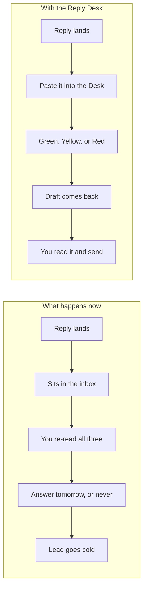
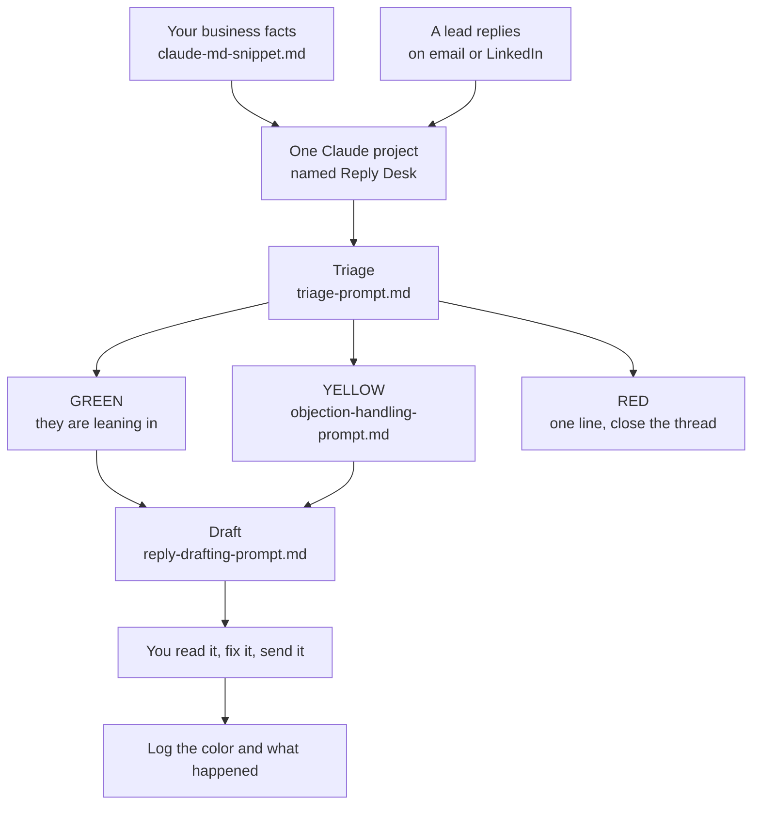

## What this is

A desk for your outbound inbox: paste a reply in, get the color and the reply to send back.

- Sorts every reply into Green, Yellow, or Red before you finish reading it.
- Drafts the exact message to send, matched to what they actually said.
- Offers two call times and books the meeting, with no calendar link.

## The problem

→ A reply lands at 9am. You open it at 6pm.
→ The one asking about price sits longest, because it needs thought.
→ Flat noes pile up in the same stack as the hot ones.
→ Tomorrow there are five more.

You paid to get every one of those replies. Waiting is the only part that was free.



## How it works



- **Your business facts** are pasted once and stay loaded. Every draft is built from them.
- **Triage** returns a color, one line of why, and the next action.
- **Green** means they want the next step, so you offer two times.
- **Yellow** means something is in the way, so you find the real reason first.
- **Red** means one polite line and stop.
- **Draft** writes the message. You are still the one who hits send.
- **Log** is a note or a sheet. It is how you find out which colors turn into calls.

Not a piece of software. Nothing to install. No automation to maintain, unless you want one.

## What you need first

| Tool | What it does here | Free or paid | Link |
|---|---|---|---|
| Claude | Runs the triage, drafting, and objection prompts | Free to start. Pro is $20 a month for higher limits | https://claude.ai |
| Your email inbox | Where cold email replies already land. Nothing to connect | Free, whatever you already use | - |
| LinkedIn | Where DM replies already land. Nothing to connect | Free | https://linkedin.com |
| A note or a sheet | One row per reply: date, name, color, what happened | Free. Google Sheets, Notion, or a notebook | - |
| n8n (Phase 3 only, optional) | Automates the paste step if you want it hands off | Free if you host it yourself. Cloud plans are paid, check their pricing page | https://n8n.io |

> [!NOTE]
> Before you start, make sure you can log into: claude.ai, the email account your cold replies land in, and LinkedIn. That is the whole list for Phases 1 and 2. Phase 3 also needs an n8n account.

## Get the files

The files live in a public folder on GitHub. GitHub is where people keep files like this. You do not need an account and you do not need to know how it works.

**The folder:** https://github.com/gary-chakraborty/gap-build-vault/tree/main/builds/ai-inbox-manager

You can read every file right there in the browser. Click a file name and it opens as a page.

**To download all of them at once:**

1. Open https://github.com/gary-chakraborty/gap-build-vault
2. Find the green **Code** button near the top right of the file list.
3. Click it. A small menu drops down.
4. Click **Download ZIP** at the bottom of that menu.
5. Open the downloaded ZIP, then open the folder `builds/ai-inbox-manager`.

> [!TIP]
> You do not have to download anything. Opening each file in the browser and copying the text works exactly as well, and it is faster the first time.

| File | What it is | What you do with it |
|---|---|---|
| `claude-md-snippet.md` | A fill in the blanks block about your business | Fill in every bracket, paste it into your project once |
| `triage-prompt.md` | The prompt that returns Green, Yellow, or Red | Paste it in once, then paste replies under it |
| `reply-drafting-prompt.md` | The prompt that writes the message to send | Paste it in after a Green or Yellow |
| `objection-handling-prompt.md` | The prompt that finds the real reason behind a pushback | Paste it in when a Yellow is a real objection |
| `setup-checklist.md` | The install order and your first week routine | Read it once, follow it on day one |

## Build it

### Phase 1: Set up the desk and teach it your business

1. Go to https://claude.ai and sign in. Create a free account if you do not have one.
   - You should see a chat box in the middle of the screen and a sidebar on the left.
2. In the left sidebar, click **Projects**.
   - You should see a page titled Projects with a button for a new one.
3. Click **New project**. In the name field, type `Reply Desk`. Click **Create project**.
   - You should now be inside an empty project with its own chat box.
4. Open `claude-md-snippet.md` from the folder above. Fill in every bracket with your real details. Every one.
5. In your project, find **Project knowledge** on the right side. Click **Add content**, then **Add text**. Paste your filled in block. Save it.
   - You should see your text listed under Project knowledge with a file name next to it.

> [!WARNING]
> Do not leave a single bracket unfilled. An empty slot means Claude guesses, and a guess about your price or your guarantee, sent to a real lead, is worse than no reply at all. If you do not have a guarantee, write "no guarantee yet" in that slot so it has something to obey.

**You know this phase worked when:** you open a new chat inside the Reply Desk project, ask "what do I sell and who do I sell it to", and Claude answers with your real offer and your real buyer, not a generic description.

### Phase 2: Load the prompts and triage your first reply

1. Inside the Reply Desk project, click the chat box and start a new chat.
2. Open `triage-prompt.md`. Copy the text inside the code block. Paste it into the chat. Press enter.
   - You should see Claude confirm it is ready and ask you to paste a reply.
3. Find an old reply from a real lead that you already answered yourself. Copy what you sent and what they said back.
4. Paste both into the same chat. Press enter.
   - You should get back a color, one sentence of why, and a next action.
5. Compare the color to what you decided at the time. If it matches, the desk is calibrated.
6. Open `reply-drafting-prompt.md`. Copy the code block, paste it into the same chat under the color, press enter.
   - You should get back a short message and a one line note on what to do after sending.
7. Rename the chat so you can find it tomorrow. Hover the chat in the sidebar, click the three dots, click **Rename**, and call it `Desk` plus today's date.

> [!TIP]
> Keep `reply-drafting-prompt.md` and `objection-handling-prompt.md` open in two browser tabs. During a real day you want to paste from them in two seconds, not go hunting.

> [!WARNING]
> Run this on two or three old replies before you let it touch a live lead. If a draft comes back generic, the fault is almost always a vague slot in `claude-md-snippet.md`, not the prompt. Fix the slot and run it again.

**You know this phase worked when:** you paste an old reply and get back the same color you picked at the time, plus a draft close enough that you would only change a word or two.

### Phase 3 (OPTIONAL): Automate the paste step with n8n

Phases 1 and 2 are the whole build. This phase only removes the copy and paste. Skip it entirely if you are not already using an automation tool.

> [!NOTE]
> This route needs an n8n account, either self hosted or on their cloud. We are not shipping a ready made workflow file here on purpose: an untested JSON that fails on import wastes more of your evening than building it yourself. The prompt below builds it against your own stack, and the blueprint table lets you check every node it makes.

**Step 1. Generate a workflow for your own stack.** Open a new chat in Claude, paste this in, and answer its questions:

```
You are building an n8n workflow for me. I am not a developer, so explain every
answer in plain words and never assume I know an n8n term.

Before you write anything, ask me these questions one at a time and wait for my
answer each time:
1. Where do my cold replies land? (Gmail, Outlook, a sending tool like Smartlead
   or Instantly, or somewhere else)
2. Where do I want the drafted reply to appear? (as an unsent draft in my inbox,
   in Slack, in a spreadsheet, or somewhere else)
3. Where do I want the log to go? (Google Sheets, Airtable, Notion, or nowhere)
4. Do I want a notification when a hot reply lands, and where?
5. Which AI account do I have set up in n8n already, if any?

Once I have answered all five, build me a single n8n workflow that does this:

- Triggers when a new reply arrives in the place I named.
- Drops anything that is not a real human reply: out of office, bounces,
  auto-acknowledgements, and anything from a no-reply address.
- Sends the reply text to Claude with MY triage rules, and gets back exactly
  three things: a color of GREEN, YELLOW, or RED, one sentence of why, and the
  next action.
- Routes each color down its own branch.
- For GREEN and YELLOW, sends the reply text back to Claude with MY drafting
  rules and gets back a short message to send.
- Saves that message as an UNSENT DRAFT. Never send anything automatically.
- Appends one row to my log: date, lead name, lead email, color, the reason,
  and the draft.
- Notifies me only on GREEN.
- Has an error path on every step that touches an outside account, so a failure
  tells me instead of going quiet.

Output the workflow as n8n JSON I can import, with every credential field left
empty for me to fill in. Then, underneath the JSON, give me a numbered list of
what I have to click in n8n to connect each account, naming the exact buttons.

I will paste my triage rules and drafting rules in my next message.
```

Then paste the contents of `triage-prompt.md` and `reply-drafting-prompt.md` when it asks.

**Step 2. Import what it gives you.** In n8n, go to **Workflows**, click the **three dots** in the top right, then **Import from File** (or **Import from URL** if you saved it online). Save the JSON to your computer first, then pick it.

- You should see a canvas with connected boxes, each with a red warning triangle because no accounts are connected yet.

**Step 3. Check it against this blueprint before you turn anything on.** Click each node and compare. If a node is missing, add it. If a node sends instead of drafting, change it.

| Node | Type | What it does | Connects to |
|---|---|---|---|
| New reply | Gmail Trigger, Outlook Trigger, or Webhook | Fires when a reply lands in your inbox or your sending tool | Real human filter |
| Real human filter | Filter | Drops out of office, bounces, and no-reply senders | Triage |
| Triage | Claude (message a model) | Returns the color, one line of why, and the next action | Route by color |
| Route by color | Switch | Sends GREEN, YELLOW, and RED down three separate paths | Draft the reply, Close the thread |
| Draft the reply | Claude (message a model) | Writes the message using your drafting rules | Save as draft |
| Close the thread | Set | Marks RED as handled with no message written | Log it |
| Save as draft | Gmail or Outlook, create draft | Puts the message in your drafts folder, unsent | Log it |
| Log it | Google Sheets, append row | One row per reply: date, name, email, color, reason, draft | Notify me |
| Notify me | Slack or email | Pings you on GREEN only, so the alert still means something | End |
| Error catch | Error Trigger workflow | Tells you when any step above fails, instead of failing quietly | Notify me |

> [!WARNING]
> Set every message node to create a draft, never to send. An AI that sends without you reading it will eventually send something you would not have. The draft step is the whole safety net.

> [!TIP]
> Turn the workflow on with a test email to yourself first. Send yourself a message that says "sounds interesting, what does this cost", and watch it move through the canvas one node at a time.

**You know this phase worked when:** you send yourself a test reply, and within a minute an unsent draft appears in your drafts folder, a new row appears in your log with the color YELLOW, and no message has been sent to anyone.

## Run it the first time

Open your Desk chat. Paste in this reply, exactly as written. (This is a made up lead, not a real one.)

```
Hey thanks for reaching out, what's this going to cost roughly?
```

You should get back something close to this:

> **YELLOW**
> Why: they are evaluating, not committing, and they asked a direct price question.
> Next: do not quote a number. Acknowledge the question and move to the call.

Now open your `reply-drafting-prompt.md` tab, copy the code block, paste it into the same chat underneath that result, and press enter.

You should get back something close to this:

> Good question. It depends on scope, so it's something we cover on the call. Happy to walk you through it. Thursday at 2pm or Friday at 11am?

That is the whole loop. Reply in, color out, draft out, you send.

> [!WARNING]
> The most common first run mistake is leaving `claude-md-snippet.md` vague. "We help businesses grow" in the WHAT I SELL slot produces a draft that reads like every other cold DM in their inbox. Go back and write the sentence you would actually say out loud to a buyer, with your real proof point and your real price rule, before a draft reaches a live lead.

## When it breaks

| What you see | What it means | What to do |
|---|---|---|
| A blunt one line reply gets called RED, but it was really a question | It is judging tone instead of words | Paste the RED and YELLOW definitions back into the chat and add "judge what they said, not how it sounds". Re-run that reply |
| Every draft sounds the same, and none of them sound like you | Your business block is generic in one or more slots | Rewrite WHAT I SELL, MY REAL PROOF POINTS, and MY TONE with real specifics, then update the text in Project knowledge |
| It quotes a price, a guarantee, or a client result you never gave it | A slot was left empty or still has a bracket in it | Fill the slot. If you do not have that thing, write "no guarantee yet" or "no range yet, always redirect to the call" so it has a rule to follow |
| It invents call times you are not free for | It has no idea what your calendar looks like | Paste your two real open times into the chat before asking for a draft, every morning |
| A reply asks three questions, the draft answers one | Long stacked replies get flattened | Reply in the chat with "answer every question they asked, in order, then offer the two times" |
| The drafts drift after a long day of pasting | The chat got long and your rules scrolled out of reach | Start a new chat inside the Reply Desk project. The project knowledge loads again automatically |
| Phase 3 only: the workflow runs green but no draft appears | The node is set to send rather than create a draft, or the account connected is the wrong inbox | Open the Gmail or Outlook node, check the operation says create draft, and check the account at the top of the node |
| Phase 3 only: nothing runs at all and there is no error | The workflow was saved but never activated | Open the workflow and switch the **Active** toggle in the top right to on. Check the Executions tab for a run |

## Tell me how it went

I am not asking for your email. There is no list, no sequence, nothing to unsubscribe from.

Two minutes, three things: how you found this, whether it was useful, and what you want me to build next. https://form.jotform.com/262191867802059

The next build comes from those answers.
