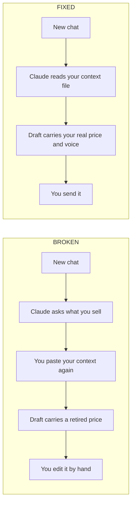
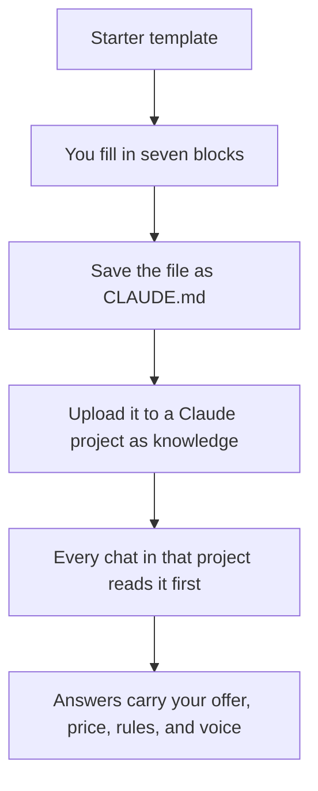

## What this is

A text file Claude reads before every chat, so it starts already knowing your business.

- Answers with your real offer, price, and guarantee on the first try.
- Ends the paste-my-context-again ritual at the top of every chat.
- Holds your writing rules and banned words so drafts sound like you.

## The problem

→ Every new chat starts blank. It does not know your offer.

→ You paste the same context again. Monday, Friday, this morning.

→ It quotes a price you retired, inside a client-facing draft.

→ Fifteen minutes a day, five days a week. Run that against your own hourly rate.



## How it works



- **Starter template:** a file of labelled blanks, so no block is a guess.
- **Seven blocks:** who you are, what you sell, pricing rules, who you sell to, writing rules, output standards, things Claude must never do.
- **Save as CLAUDE.md:** the name is the whole trick. Nothing else changes.
- **Upload as project knowledge:** it loads itself from then on.
- **Every chat reads it first:** you never paste context again.

Not a piece of software. Nothing to install, nothing to connect, no code. One file, filled in once, checked once a month.

## What you need first

| Tool | What it does here | Free or paid | Link |
|---|---|---|---|
| Claude | Reads your file at the start of every chat inside the project | Free plan works. Pro is $20 a month for higher limits | https://claude.ai |
| A plain text editor | Where you fill in and save the file | Free. TextEdit on a Mac, Notepad on Windows | Already on your machine |

> [!NOTE]
> Before you start, make sure you can log into claude.ai in a browser. Projects live in the left sidebar. If you cannot see Projects, you are signed out or on a work account that hides them.

## Get the files

Everything sits in one folder on GitHub: https://github.com/gary-chakraborty/gap-build-vault/tree/main/builds/claude-md-starter

You do not need a GitHub account and you do not need any git software. On that page, click the green **Code** button near the top right, then click **Download ZIP**. Your browser downloads one zip file. Double click it to unzip, then open the folder called `builds`, then `claude-md-starter`.

| File | What it is | What you do with it |
|---|---|---|
| `CLAUDE-md-starter-template.md` | The blank starter, seven labelled blocks, plus a filled example at the bottom | This is the one you fill in. Everything starts here |
| `CLAUDE-md-example-filled.md` | The same filled example as its own file, for a fictional agency | Keep it open beside the template so the shape is never a guess |
| `README.md` | This page | Nothing. It is the instructions you are reading |

## Build it

### Phase 1: Create the file

1. Open `CLAUDE-md-starter-template.md` in TextEdit, Notepad, or paste it into a blank Google Doc if that is easier to read.
2. You should see seven headed sections, each full of bracketed blanks like `[YOUR BUSINESS NAME]`.
3. Save a copy under a new name so the original template stays clean.

> [!TIP]
> On a Mac, TextEdit opens in rich text by default. Press Format, then Make Plain Text, before you save. A rich text file adds hidden formatting Claude does not need.

**You know this phase worked when: you have your own copy open, still full of brackets, and the original template file untouched.**

### Phase 2: Fill each block

1. **Who I am and what my business does.** Two or three sentences, written the way you would say it out loud to a stranger at a bar.
2. **My offer and pricing rules.** The exact price, the exact guarantee, and the rules around them: what you never discount, what you never quote over email.
3. **My ICP.** Who you sell to and, just as important, who you refuse. A one line refusal rule saves more bad drafts than the whole rest of the file.
4. **Writing rules.** Three real examples of how you talk: a sentence you would actually send, a word you never use, and a phrase you are tired of seeing from AI tools.
5. **Output standards.** Format rules you genuinely care about. Length caps, no bullet points inside emails, subject line limits.
6. **Things Claude should never do.** The section people skip and regret. List the specific mistakes that already reached a client.
7. Delete every bracket you did not fill. An empty bracket is worse than a missing section, because Claude reads it as an instruction to invent something.

> [!WARNING]
> Do not paste in your whole website, your full sales deck, and three past proposals. A long file gets skimmed. Everything you add pushes something else out of Claude's attention. Aim for two pages, then cut.

**You know this phase worked when: you can read the file top to bottom with zero brackets left and zero sentences you would not defend to a client.**

### Phase 3: Load it into a Claude project

1. Save the file with the exact name `CLAUDE.md`, capital letters included.
2. Go to **claude.ai** in your browser.
3. In the left sidebar, click **Projects**.
4. Click **Create project** in the top right.
5. Name it after your business and click **Create project** again to confirm.
6. Inside the project, find the **Project knowledge** panel on the right.
7. Click **Add content**, then **Upload from device**, and choose your `CLAUDE.md` file.
8. You should see the filename listed under Project knowledge with a size next to it.

> [!WARNING]
> The file has to sit in the project's knowledge, not pasted into a single chat. A paste dies with that conversation. Project knowledge loads into every new chat you start inside that project, forever.

**You know this phase worked when: your file is listed by name under Project knowledge, and the project shows up in your left sidebar.**

### Phase 4: Test it against a real task

1. Click **New chat** from inside the project, not from the sidebar home. The project name should show at the top of the chat.
2. Type a real task you have this week, not a quiz question.
3. Read the answer for three things: your real price, your real guarantee, and your own words.
4. Anything wrong or generic is a missing line in the file, not a Claude problem. Go back, add the line, upload the file again.

**You know this phase worked when: an answer comes back you would send with one small edit, on the first try, without you pasting anything.**

## Run it the first time

Open a new chat inside the project and paste this exactly:

```
A lead just replied saying our price is too high. Draft the reply I should send.
```

A working file gives you something shaped like this, in your voice. The business and the numbers below are made up, not a client of ours:

> Thanks for being straight with me. The six month program is $7,640, and that price includes the rework guarantee we talked through on the call. Before I try to talk you into anything: is the price the real blocker, or is it the timing? Happy to walk through either. Are you free Thursday at 2pm or Friday at 11am?

Your numbers, your guarantee wording, your call to action. If instead you get a polite paragraph that starts with something like "I completely understand your concern" and never names a price, the file is not being read or the pricing block is empty.

> [!WARNING]
> The most common first run mistake: filling in the facts and skipping the writing rules. The price is right, the tone still reads like a stranger. Fix it by adding three real examples to the writing rules block, a sentence you would send, a word you never use, and a phrase you are sick of seeing.

## When it breaks

| What you see | What it means | What to do |
|---|---|---|
| Claude answers like the file does not exist, asks what you sell | You are in a chat outside the project, or the file was pasted into a chat instead of uploaded | Check the project name shows at the top of the chat. Start the chat from inside the project, and confirm the file is listed under Project knowledge |
| Claude follows one rule and breaks another in the same reply | Two lines in your file contradict each other, so it picks one | Read the file for the pair. A common one is "keep replies under 80 words" sitting above a rule that demands a case study, a price, and two time slots. Delete one, keep the other |
| Answers get vaguer over the weeks, and rules you wrote get ignored | The file has grown past what gets read closely. Every added paragraph dilutes the rest | Cut it back toward two pages. Move long reference material into a separate file and keep only the rules in `CLAUDE.md` |
| Claude quotes a price or a guarantee you changed months ago | The file is stale. It was uploaded once and never touched again | Update the file on your machine, then in Project knowledge delete the old version and upload the new one. Uploading a second copy without deleting the first leaves both versions loaded |
| Two people on your team get different answers to the same question | Each is running their own copy, filled in differently | Keep one file as the source. Anyone who edits it re-uploads it to the shared project, and nobody keeps a private version |

## Tell me how it went

I read every one of these. Two minutes, five questions: what you used, how, and what happened. https://form.jotform.com/262191867802059 The best stories become the next build.

## Want this built for you?

This is one piece of the system we install for B2B service businesses: 15-25 qualified sales calls a month without referrals or hiring a sales team. If you'd rather have the whole thing built for you, grab a call: https://calendly.com/garychakraborty
