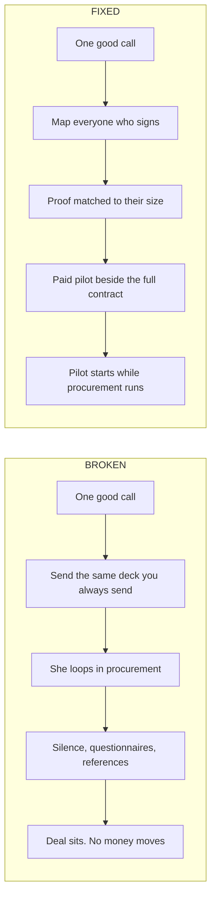
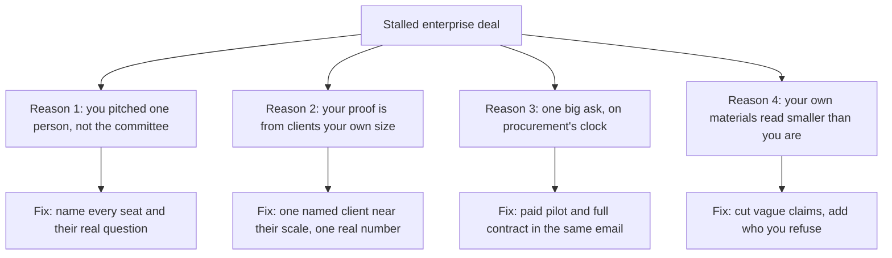

## What this is

A guide to the four specific reasons an enterprise deal stalls, and what you change for each.

- Maps everyone who has to say yes, before you pitch one person.
- Sizes your proof to the buyer instead of to your own comfort.
- Splits the money ask from the vendor approval ask, so procurement (the department that signs off on new vendors) cannot park you.

## The problem

→ One buyer loved the pitch. She cannot sign alone.

→ Four people you have never spoken to have to agree first.

→ A security questionnaire arrives. Nobody has said no. Nobody has said yes.

→ Six weeks gone. Multiply your own hourly rate by the hours you have spent chasing it.

## How it works

Four reasons, and only four. Find the one holding your deal and the fix is an action, not a feeling.

- **Reason 1** is a mapping problem. You are selling to a person when a group decides.
- **Reason 2** is a proof problem. Nobody gets fired for hiring the vendor who has done it at their size.
- **Reason 3** is a timing problem. Procurement runs its own calendar and does not care about yours.
- **Reason 4** is a positioning problem. Vague claims read as small, not safe.

Not a tool. Nothing to install. This is a sequence of changes to your deal map, your proof, your offer shape, and your one pager.

## What you need first

| Tool | What it does here | Free or paid | Link |
|---|---|---|---|
| LinkedIn | Find and name the people who sign off, before you pitch | Free covers this. Sales Navigator is $99.99 a month if you want deeper filters | https://www.linkedin.com |
| Google Docs | Hold the deal map and the one page proof pack | Free | https://docs.google.com |
| Google Sheets | Track the committee, the procurement checklist, and the pilot terms in one place | Free | https://sheets.google.com |

> [!NOTE]
> Before you start, have three things open: your last stalled enterprise thread, your case study folder, and your most recent proposal. Everything below is edits to those, not new material written from scratch.

## Get the files

This one's all on this page. Read it, steal it, nothing to download.

## Build it

### Phase 1: Map who actually signs

1. Open a new Google Doc. Title it **Enterprise Deal Map** plus the client's name.
2. List every person already attached to the deal: the person who invited you in, anyone they said they would loop in, and any name from legal, security, or finance.
3. You should see three to five names. If you see one, that is the finding, not a shortcut.
4. Next to each name write their real question in their words: does this fix my problem, is this safe to buy, does this fit the budget line.
5. Under each question write one line of proof, using a real number from your own work. One line, not a paragraph.
6. Any name where you cannot write a proof line is your next ask to the buyer. Ask her directly who else has to be comfortable.

> [!TIP]
> The fastest way to find the missing seats is to ask the buyer what happened the last time they brought in a new vendor. She will list the steps and the people without being asked twice.

**You know this phase worked when: every person on the list has a named question and one line of proof under it, and you know which seat you still cannot see.**

### Phase 2: Resize your proof

1. Open your case study folder. Sort by client size, not by how much you liked the project.
2. Pull the three closest to the prospect's scale. Scale means staff count, locations, or spend, whichever the buyer talks about.
3. If your three best are all much smaller than the prospect, that is the stall. Do not paper over it inside the pitch.
4. Call one past client whose size is nearest and ask permission to use their name and one real result number. That call takes ten minutes and it is the highest paid ten minutes in this whole guide.
5. Rewrite each case study to a single sentence: the client's name, what changed, the number, and over how long.

> [!WARNING]
> Do not answer a scale gap with a bigger adjective. Adding "enterprise grade" to a deck built from small client work is the exact move that gets you compared to vendors with hundreds of reviews, on their terms, where you lose. One honest number at their scale beats five impressive ones at yours.

**You know this phase worked when: you can hand the buyer three one sentence case studies with real names and real numbers, and at least one is near their size.**

### Phase 3: Split the ask

1. In the same doc, write two offers side by side.
2. The first is a paid pilot: a smaller scope, a fixed number, a fixed end date, and one agreed measure of success. It has to be small enough to fit under the buyer's own approval limit.
3. Ask the buyer what she can approve without finance. That number sets the pilot price, not your wish.
4. The second is the full contract, priced and scoped as normal, moving on procurement's timeline.
5. Put both in the same email. Never send the pilot later as a rescue.
6. Write the pilot's success measure as one sentence both sides could check without arguing.

> [!WARNING]
> A free pilot is not a smaller ask, it is a bigger one. Unpaid work has no budget owner, so nobody defends it internally and it slips whenever anything else moves. Paid, even small, gives your deal a person whose money is on it.

**You know this phase worked when: your next email to the buyer carries the pilot and the full proposal together, each with its own number and its own timeline.**

### Phase 4: Fix what reads small

1. Open your pricing page and your last proposal. Read both as a stranger who has never heard of you.
2. Delete every "starting at". A price you will not state reads as a price you will drop.
3. Delete every statistic you cannot attach to a client name and a date.
4. Add one line naming who you do not work with. A refusal is the cheapest credibility signal you own.
5. Replace any "we have worked with dozens of brands" line with one named client and one number.
6. Send the updated one pager to a friend outside your industry. Ask them what you do and who you do it for. If they cannot answer both in one go, it still reads small.

**You know this phase worked when: someone outside your industry reads the one pager and tells you, correctly, what you sell and who you refuse.**

## Run it the first time

> [!IMPORTANT]
> What follows is a made-up example, not a client of ours. Every company, person, and number below is invented so you can watch the four moves in order. Do not quote any of it as a result.

Say you run an 11 person paid social agency. Your average client pays $4,850 a month. A regional grocery chain with 340 stores took a call after a referral, and their director of marketing liked the deck.

**Phase 1, the map.** On the call you learn the director reports to a VP of marketing, and anything over $75,000 needs finance sign off. Three seats, not one. The director wants results. The VP wants no surprises in front of her boss. Finance wants a fixed number for a budget line, not a monthly variable.

**Phase 2, the proof.** Your two strongest case studies are both from clients under 10 locations. You call a past client, a 22 store regional pharmacy chain, and get permission to name them plus one real number: a 34 percent rise in in store redemptions over 5 months. Your proof now sits near the buyer's scale instead of under it.

**Phase 3, the split.** Instead of pitching the full year at $189,400, you send two things in one email: a 90 day pilot across 40 stores at $22,500, and the full rollout priced as normal. The pilot sits under the director's own approval limit, so it can start while finance is still reading.

**Phase 4, the read.** You cut "we have worked with dozens of brands" from the one pager. In its place goes the pharmacy chain's name, the 34 percent, and one line: you do not work with single location businesses.

What you are aiming at is a signed pilot, not the full deal. A pilot is real money on your timeline, and it becomes the proof you were missing for every other account stuck the same way.

> [!WARNING]
> The mistake almost everyone makes on the first run: they do Phase 2, fix the proof, and skip Phase 3. The deck is better and the deal still sits, because the ask is still one big number on procurement's clock. Both offers, one email, every time.

## When it breaks

| What you see | What it means | What to do |
|---|---|---|
| Your champion (the person on the inside pushing for you) goes quiet after a good call | She hit an internal blocker she cannot solve, or she was moved off the project. Silence is almost never about your price | Send one email that gives her something to forward, not something to answer: the one page proof pack and the pilot terms. Then ask directly who else needs to be comfortable and offer to answer them yourself |
| Procurement adds a step you did not plan for, like a security questionnaire or an insurance certificate | You are being processed as a vendor, which is progress, but their checklist is running in parallel and nobody told you | Ask for the full list of steps and who owns each one, in one email. Fill in what you can this week. Say plainly which items you do not have yet and what you will do instead. A named gap moves. A dodged question stops the file |
| They ask for three reference clients their own size and you do not have them | Your proof is sized to your comfort, not to the buyer. This is Phase 2 arriving as a demand instead of a choice | Offer what is real: your closest client by scale, named, with a number, plus a paid pilot that makes the reference unnecessary. Never pad the list with a client who will not take the call |
| The pilot gets scoped down until it cannot prove anything | Somebody inside is protecting a budget, or the success measure was never agreed | Rewrite the pilot around one measure both sides can check. If the scope drops below what can move that measure, say so and pause rather than accept a test designed to fail |
| Six weeks pass with no no and no yes | There is no owner for the decision, only participants | Ask the buyer for the date the decision gets made and what has to be true by then. Work backwards from that date. If no date exists, the deal is not stalled, it has not started |

## Tell me how it went

I am not asking for your email. There is no list, no sequence, nothing to unsubscribe from.

Two minutes, three things: how you found this, whether it was useful, and what you want me to build next. https://form.jotform.com/262194392563059

The next build comes from those answers.
