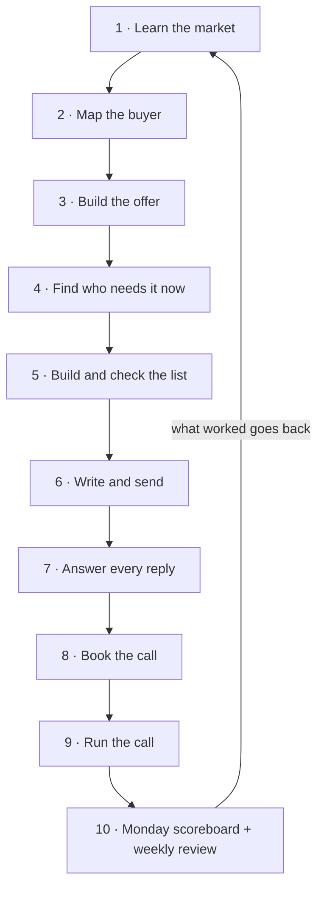

## What this is

Most AI sales setups are a straight line. Find people, write, send, done.

This is the loop version. Nine steps, an agent on each one, and a tenth step that takes what
worked and feeds it back into step 1. Next month's research starts from this month's sales calls.

Two things are in here that the other builds in this vault leave out:

**1. The whole install.** Every account, every key, which connections to turn on inside Claude,
and where a connection stops short so you have to call the tool's API directly.

**2. What breaks, and the guard for each one.** Most of these failures are quiet. Nothing errors.
The numbers just come out wrong, or nothing sends, and it looks fine.

## The loop

| Step | The agent's job | Where the prompt lives |
|---|---|---|
| 1 · Learn the market | Who buys this, how big, who you compete with. Every fact dated | [The Eight Agents](../outbound-agent-stack/) · agent 1 |
| 2 · Map the buyer | The words buyers use for their own problem, with the source for each quote | The Eight Agents · agent 2 |
| 3 · Build the offer | One promise with every blank pinned, checked against what competitors are running right now | The Eight Agents · agent 3, plus `03b-competitor-ads-prompt.md` here |
| 4 · Find who needs it now | One dated reason to write to each company this week. No reason, no message | [Signal Check](../signal-prospecting-system/) and The Eight Agents · agent 6 |
| 5 · Build and check the list | Real companies only, one person each, every address verified | The Eight Agents · agents 4 and 5 |
| 6 · Write and send | Two touches from a script that already works, then stop | The Eight Agents · agent 7 |
| 7 · Answer every reply | Sort it, draft the answer, a person sends it within minutes | [The Reply Desk](../ai-inbox-manager/) |
| 8 · Book the call | Two real times, booked for them, reminders that do not double up | [Reply to Booked Call](../reply-to-booked-call/) |
| 9 · Run the call | A brief before, a score after | `09-call-brief-prompt.md`, `10-call-score-prompt.md` here |
| 10 · Feed it back | Count the week properly, then change one thing in step 1, 3 or 4 | `11-weekly-loop-prompt.md` here |

**The order is the product.** Step 10 is the one almost everyone skips. Without it you run the
same loop with the same mistakes every month and call it consistency.

## The 13 agents and the brain they share

Every agent below is a Claude skill: one folder with its instructions, its rules and its examples.
None of them start from zero. Each one reads the brain first.

**The brain** is one folder of plain notes (Obsidian works well) that every agent can search:
what buyers said on calls, which reasons for writing got replies, which offers booked calls, and
what went wrong last time. Ours holds 1,237 notes with 3,955 links between them. Yours starts
with one file about your business and grows every week.

| # | Agent | What it does | Runs on | Reads first, from the brain |
|---|---|---|---|---|
| 01 | Market Scout | Learns the market: what is changing, who is buying, in dated facts | Web search, Reddit, review sites | Past research on this market, so it only adds what is new |
| 02 | Buyer Mapper | Maps the buyer in their own words | Claude | Buyer quotes from past calls and replies |
| 03 | Offer Builder | One promise, one number, every blank pinned | Claude | Which offers booked calls before, and which did not |
| 04 | Signal Hunter | Finds who needs it this week: new hires, funding, new leaders | Job boards, funding news, Apify | Which reasons for writing got replies last month |
| 05 | List Builder | One right person per company, every email checked | Apollo, MillionVerifier | Who is already on a list or already said no |
| 06 | Researcher | One line on each person's week, from a public source | Web, Claude | What a good line looked like on past sends |
| 07 | Email Writer | Two touches, then stop | Smartlead | The written templates that worked, line by line |
| 08 | LinkedIn Writer | Connect, then one message and one bump | HeyReach | Same as the Email Writer |
| 09 | Reply Desk | Labels every reply and drafts the answer in Slack | Slack | How each kind of reply was answered before |
| 10 | Booker | Gets the call on the calendar, counts every reminder | Calendly | What reminders already went out |
| 11 | Call Prep | A brief the morning of every call | Claude | Every past call with a buyer like this one |
| 12 | Call Coach | Scores every call and writes the fix for next time | Claude | The scoring rubric and your last scored calls |
| 13 | Metrics Agent | Measures every step: people reached, replies, calls booked, call scores, which offer and which reason. Posts one table every Monday | Your sending tools, calendar, call scores | Last week's numbers, to show the change |

**The loop closes through the Metrics Agent.** It measures every other agent: which reason for
writing got replies, which offer booked calls, how each call scored. It writes those numbers back
into the brain every week. Next week, every agent above reads them before it moves.

## What you need

Install in this order. Each one unlocks the next step.

| # | Account | Used in | Free or paid | Link |
|---|---|---|---|---|
| 1 | Claude | Every step | Free to start. Pro is $20 a month | https://claude.ai |
| 2 | A free scraper (Scrapling) | 1, 2, 4, 5 | Free | https://github.com/D4Vinci/Scrapling |
| 3 | Serper (Google search API) | 1, 2, 4 | Free for the first 2,500 searches | https://serper.dev |
| 4 | Apify | 2, 3, 4 (LinkedIn and ad-library reads) | Pay per run, a few cents per company | https://apify.com |
| 5 | Apollo (or the contact tool you already pay for) | 5 | Paid credits. People search itself costs no credits | https://apollo.io |
| 6 | MillionVerifier | 5 | 100 free checks, then about $1.80 per 1,000 | https://millionverifier.com |
| 7 | Smartlead (email) | 6, 7, 10 | Paid | https://smartlead.ai |
| 8 | HeyReach (LinkedIn) | 6, 7, 10 | Paid, per LinkedIn seat | https://heyreach.io |
| 9 | Slack | 7, 8, 10 | Free works to start | https://slack.com |
| 10 | Calendly | 8, 10 | Paid plan for the API | https://calendly.com |
| 11 | Whisper (call transcripts, runs on your computer) | 9 | Free | https://github.com/openai/whisper |
| 12 | A tracker (Airtable or a Google Sheet) | 7, 10 | Free works | https://airtable.com |
| 13 | Gemini and OpenAI API keys (backups for Claude) | Any scripted step | Gemini has a free tier | https://aistudio.google.com |

> [!NOTE]
> You do not need all thirteen on day one. Steps 1, 2, 3 and 9 run on nothing but a Claude
> account. Start there. Add the paid tools when you reach the step that needs them.

The full detail for each account: what key to make, what permission it needs, which
connection to switch on, and how you know it worked is in **`stack-install.md`**.

## Get the files

Everything is in a public folder on GitHub. No account, no sign-up.

**The folder:** https://github.com/gary-chakraborty/gap-build-vault/tree/main/builds/gtm-loop

| File | What it is | What you do with it |
|---|---|---|
| `stack-install.md` | Every account in order: the key, the permission, the connection, the check | Follow it top to bottom, one tool at a time |
| `connections.md` | Which tools to connect inside Claude, and where a connection stops short | Read it before you trust any "nothing found" |
| `failsafes.md` | What breaks quietly at each step, and the guard for each | Read it before your first real send |
| `03b-competitor-ads-prompt.md` | Reads what competitors are running and how long it has lasted | Run it before you lock the offer |
| `09-call-brief-prompt.md` | A one-page brief before every sales call | Run it the morning of the call |
| `10-call-score-prompt.md` | Scores a recorded call and names where it slipped | Run it within a day of the call |
| `11-weekly-loop-prompt.md` | Turns the week's numbers into one change for next week | Run it every Monday |
| `llm_router_example.py` | A small script: Claude first, then Gemini, then OpenAI, and it fails loudly | Use it for any step you automate |
| `setup-checklist.md` | The install order and your first two weeks | Follow it day one |

## Build it

### Before step 1: one file about your business

Use the business block from [The Eight Agents](../outbound-agent-stack/) (`claude-md-snippet.md`)
or [The Context File](../claude-md-starter/). Fill every bracket. Every agent in the loop reads it
first, and step 10 is the step that keeps it current.

**You know this worked when:** a new chat answers "what do I sell and who buys it" with your
real offer and your real buyer.

### Steps 1 to 6: research, offer, list, send

Run them from The Eight Agents and Signal Check, in order. Two additions from this build:

1. Before you lock the offer, paste `03b-competitor-ads-prompt.md`. It sorts competitor ads by
   how long they have been running. An ad live for 60 days or more, with 3 or more versions, is
   one that is paying for itself.
2. Before you load anything into a sending tool, read the Smartlead and HeyReach sections of
   `failsafes.md`. Both tools can accept your list, report success, and send nothing.

**You know this worked when:** you can name, for every person on the send list, what changed at
their company and when, and your sending tool shows real sends after the first hour.

### Steps 7 and 8: reply and book

Set up [The Reply Desk](../ai-inbox-manager/) and [Reply to Booked Call](../reply-to-booked-call/).
Then wire the reply alert using the pattern in `connections.md`: reply → a small relay → Slack.

> [!WARNING]
> If the part that reads and labels a reply fails, the alert must still post, marked
> "unlabelled". An alert that waits for a perfect label goes quiet for hours the day your
> AI credit runs out.

**You know this worked when:** you reply to your own test email and a Slack card shows up
within a few minutes, with the draft answer already on it.

### Step 9: the call

1. The morning of the call, paste `09-call-brief-prompt.md` with the person's name, company,
   the message they replied to, and their reply.
2. Record the call (with permission). Transcribe it with Whisper.
3. Paste the transcript into `10-call-score-prompt.md`.

> [!TIP]
> Use your best model once to write the scoring rubric. Then let a cheaper model score every
> call against it. The rubric holds the judgment. Re-running the most expensive model on every
> call costs more and scores no better.

**You know this worked when:** the score names one exact moment and gives you the line you
should have said, not a general tip.

### Step 10: feed it back

1. Every Monday, count last week. Use the scoreboard script from
   [Reply to Booked Call](../reply-to-booked-call/) (`weekly_scoreboard.py`) or count by hand
   from the tools.
2. Paste the numbers into `11-weekly-loop-prompt.md`.
3. Make the **one** change it gives you. Update your business file so step 1 starts from it.

> [!WARNING]
> Count **new people reached**, never emails sent. Emails sent counts every follow-up again,
> so every rate looks about half its real size. And split replies by the reason you wrote to
> each person. A blended rate hides the one reason that is working.

**You know this worked when:** next week's list, offer or opening line is different because of
something last week's numbers showed.

## What breaks first

The five that come up most, from running this loop for real. Full list in `failsafes.md`.

| What you see | What it really is | The guard |
|---|---|---|
| A research step comes back empty and calm | A site blocked the read and the code hid it | A block must raise an error. Empty and blocked must never look the same |
| A tool says the import worked. Nothing sends | Missing fields dropped silently, or no schedule was set | Read the count back from the tool after every load. Check real sends after the first hour |
| A connection inside Claude says "no results" | The connection cannot see that data. The tool still has it | Check the tool's own API before you believe "none" |
| The same person gets four messages in a day | Each tool counted only its own messages | Count what already went out across every tool before adding a touch |
| Rates look fine, calls do not come | You are counting emails, not people, or blending every reason together | People reached as the bottom number. Split by reason |

## What is not in here

**Your scripts.** The templates hold the shape. Your words come from step 2.

**A done-for-you setup.** This is the full map. Putting it in for you is a different thing.

## Tell me how it went

No email needed, nothing to unsubscribe from.

Two minutes, three things: how you found this, whether it was useful, and what you want me to
build next. https://form.jotform.com/262194392563059
