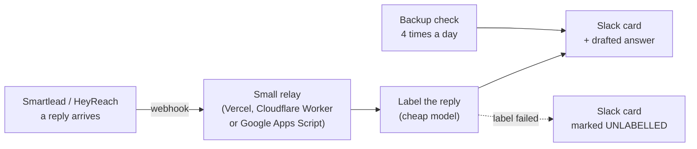

# Connections: what to plug into Claude, and where each one stops short

A connection (MCP) lets Claude use a tool directly from the chat. It is the fastest way to work.
It is also a wrapper: it shows you some of what the tool can do, not all of it.

**The one rule:** when a connection says "no results", that is a fact about the connection.
It is not a fact about your data. Check the tool's own API before you believe "there are none".

On a real build, a calling tool's connection reported "no recordings" for three people. The
tool's API returned seven calls for the same people, including two the connection could not
see at all. It only exposed some call types.

## How to add a connection

**In claude.ai (browser or app):** Settings, Connectors, then add the tool and sign in. Many
sales tools are in the list: Apollo, HeyReach, Calendly, Slack, Airtable, Notion, Gmail,
Google Drive, Clay and others.

**In Claude Code (terminal):**

```bash
# a tool that gives you a URL
claude mcp add --transport http <name> <url>

# Smartlead's server, with your key in the URL
claude mcp add --transport sse smartlead "https://mcp.smartlead.ai/sse?user_api_key=YOUR_KEY"

# see what is connected, and whether each one is working
claude mcp list
```

> [!WARNING]
> A config file with a key inside a URL is a secret. Do not commit it to a repo or share a
> screenshot of it.

## Which way to use each tool

| Tool | For quick work in chat | For anything that runs on a schedule | Where the connection stops short |
|---|---|---|---|
| Apollo | Connector | API key, `mixed_people/api_search` | The connector's login can expire mid-session. Search works on the plain API key without it |
| Smartlead | MCP server | REST API with key | Account-level and client-level webhooks are set in the app, not the public API |
| HeyReach | Connector | REST API with key | Read counts back after every load. The response body's "added" count is not proof |
| Calendly | Connector (book a person in directly) | REST API + webhooks | Reminder emails and confirmation text are set in the app only |
| Slack | Connector | Bot token, `chat.postMessage` | Channels shared with another company can refuse a connector post. A bot that is a member of the channel can still post |
| Airtable | Connector | Personal access token | Field order cannot be changed through the API. Set it when you create the table |
| Calling tool (any) | Connector for transcripts | Its REST API for the full call list | Some connectors see only incoming or missed calls |
| Apify | (none needed) | API token + actor runs | Not applicable |
| Serper | (none needed) | API key | Not applicable |

**Why schedules use the API, not the connector:** a scheduled job runs with nobody watching. A
connector's session can expire overnight. A key in a locked file does not.

## The reply alert (step 7) in one picture



Three things this shape protects you from:

1. **One platform's limits taking everything down.** An automation platform with a monthly run
   cap can stop every workflow at once when you hit it. Keep the reply path on something that
   cannot run out that way, and keep a backup check that runs a few times a day.
2. **A failed label blocking every alert behind it.** The card posts anyway, marked unlabelled.
3. **A webhook you cannot see.** A test call from your own computer to a webhook URL can return
   404 even when the webhook is live. The only proof is the platform's own delivery log, or a
   real test reply that shows up in Slack.

## A booking receiver (step 8)

Calendly sends its webhook to any URL that accepts a POST. A scheduled-only setup (cron jobs,
GitHub Actions on a timer) cannot receive it. Put a small always-on receiver in front: a Google
Apps Script web app, a Vercel function or a Cloudflare Worker. All three have free tiers.

Send reminder emails from the receiver **only if** you counted Calendly's own reminders first.
