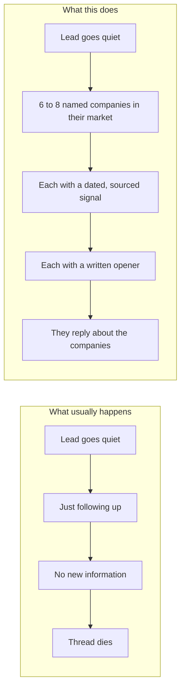
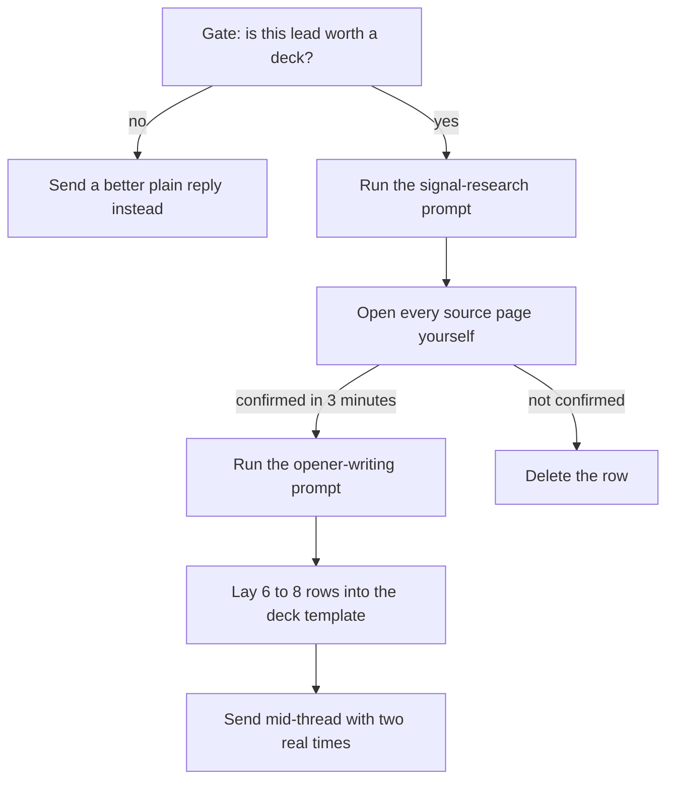

## What this is

A short deck of 6 to 8 real, named companies in your buyer's market, each carrying a dated signal and a written opener.

- Shows you can reach their exact market instead of claiming it
- Gives a stalled thread something new to react to
- Ships with the rules for when to send it and when to leave it alone

## The problem

- → A lead replied, then went quiet.
- → Your bump said "just following up". No new information.
- → Your case study proves you helped someone, somewhere else.
- → "Not interested" often means "prove it", and nothing you sent did.

Cost: you already paid to reach that lead once.



## How it works



Not a proposal. Not a pitch deck. It never states your price and it never goes out cold.

- **The gate** stops you burning an afternoon on a lead who was never going to buy.
- **The research prompt** hunts five signal types and is written to drop a company rather than invent an event for it.
- **Verification** is yours, by hand, on the real page. No exceptions.
- **The opener prompt** turns one verified signal into a message under 64 words.
- **The deck** is four columns: company, live signal, why it matters, the opener.

## What you need first

| Tool | What it does here | Free or paid | Link |
|---|---|---|---|
| Claude or ChatGPT with web search on | Runs the signal-research and opener-writing prompts | Free tier works; paid plans start at $20/month | https://claude.ai |
| Google News | Confirms a signal by hand before it enters the deck | Free | https://news.google.com |
| LinkedIn | Checks new hires, job posts, and company pages | Free to browse | https://www.linkedin.com |
| Google Sheets | Holds Company, Signal, Date, Source, Opener while you build | Free | https://sheets.google.com |
| Google Slides or Canva | Lays the finished rows out as something sendable | Free tiers cover this build | https://slides.google.com |

> [!NOTE]
> Before you start, be able to log into: your AI tool, Google Sheets, Google Slides or Canva, and the inbox where the stalled thread lives. You also need the lead's last message in front of you, because the deck is sent as a reply, never as a new thread.

## Get the files

Everything for this build sits in one folder on GitHub. GitHub is just a website that holds files.

Direct folder link: https://github.com/gary-chakraborty/gap-build-vault/tree/main/builds/named-lead-signal-deck

To get them onto your own computer without any software: open the link, click the green **Code** button near the top right, then click **Download ZIP**. Unzip it and open the folder `builds/named-lead-signal-deck`. You can also click any single file on GitHub and read it in the browser.

| File | What it is | What you do with it |
|---|---|---|
| `when-to-send.md` | The four checks that decide whether a deck is worth building, and the cases where it is not | Read first, in Phase 1, before you spend an hour |
| `signal-research-prompt.md` | The five signal types plus the prompt that finds them, with the rules that stop it inventing one | Paste into your AI tool in Phase 2 |
| `opener-writing-prompt.md` | The prompt that turns one verified signal into an opener under 64 words, plus the banned-words list | Paste in Phase 3, one row at a time |
| `deck-template.md` | The four columns, the rule for each one, and a full worked fictional example | Follow it in Phase 4 while you lay out slides |

## Build it

### Phase 1: Gate the lead and set up the sheet

1. Open `when-to-send.md` and read the four checks under "When to build one".
2. Answer all four honestly about this specific lead. Any no means stop and send a better plain reply instead.
3. Go to sheets.google.com and click **Blank spreadsheet**.
4. In row 1, type five headers: Company, Signal, Date, Source, Opener.
5. In a blank note, write one sentence describing the market this lead sells into: who they are, roughly how big, what they sell.

> [!WARNING]
> Most stalled leads do not need a deck. They need a reply that says something new. Building a deck for a lead who never opened your first message is an afternoon you do not get back.

**You know this phase worked when:** all four gate checks are a yes, your sheet has five headers, and you can state the lead's market in one sentence without editing it.

### Phase 2: Find the signals

1. Open claude.ai in a new tab and turn web search on in the chat box before sending anything.
2. Paste the prompt below, filling in the bracketed fields from your Phase 1 sentence:

```
I am building a list of [NUMBER, 6 to 8] real companies in this market:

Niche or ICP: [describe who you sell to, e.g. "mid-size third-party logistics companies,
100 to 400 staff, US-based"]

What I sell: [one sentence, in plain words]

[Pick one:]
(A) Here is a list of company names I already have: [paste names]. Find a live buying
    signal for each one.
(B) I don't have a list yet. Find [NUMBER] real, currently-operating companies that fit
    the niche above, then find a live buying signal for each.

For each company, find ONE event from this list: a new hire in an operations, finance,
or growth-leadership seat (within the last 12 months); a run of job postings that implies
the pain I solve (within the last 90 days); a funding round, acquisition, or new office
(within the last 90 days); a new service line, market, or product (within the last
90 days); or a deadline/regulatory event that hits their team (within the last
90 days).

Rules, follow these exactly:
1. Every signal must be something you can point to a real, specific source for: a news
   article, a press release, a company's own page, or a job posting. Name the source type
   and the date for every one.
2. If you cannot find a real, dated, sourced signal for a company, say so and drop that
   company. Do not invent one, do not round up a guess into a fact, do not soften an old
   event into a recent one.
3. Do not use the same signal type for more than 2 companies in the list. Mix types.
4. Do not use a fact that is true of the whole industry (like "this market is growing") as
   a signal. It has to be specific to that one company.
5. For each signal, write one plain sentence explaining why it makes this company more
   likely to need what I sell right now than it did six months ago.

Give me the results as a table: Company name | Signal | Date | Source (name the source
type, e.g. "company press release," "job board listing," "local business news") | One
sentence on why it matters.
```

3. Ask for 12 companies even though the deck holds 6 to 8. Rows die in Phase 3.
4. Paste the table into your sheet.

> [!TIP]
> If the model returns the same signal type for most rows, say "rerun rule 3, no more than 2 companies per signal type" rather than starting over.

**You know this phase worked when:** your sheet holds around 12 rows, at least three different signal types appear, and every row names a source type and a date.

### Phase 3: Verify by hand, then write the openers

1. Take row 2. Search the company name plus the event in Google News or on the company's own site.
2. Confirm the event happened, it was that company, and the date sits inside the window (12 months for a new hire, 90 days for everything else).
3. Confirmed within about three minutes: paste the real URL into the Source cell. Not confirmed: delete the row.
4. Repeat until you have 6 to 8 rows that all survived.
5. Write the first opener yourself, by hand, against the rules in `opener-writing-prompt.md`. It teaches you the shape faster than reading about it.
6. For every remaining row, paste this prompt with that row's details filled in:

```
Turn this into a cold opener, following the rules exactly.

Company: [name]
Signal: [the dated event]
Why it matters: [your one sentence from the deck]

Rules:
1. Under 64 words total. Count them and tell me the count.
2. Line one states the signal back to them plainly, like you noticed it yourself.
3. Line two is the end result the signal implies for them, in plain words. No pitch.
   No price. No meeting ask. No calendar link.
4. Write at a 7th-grade reading level. Short sentences, no jargon.
5. Do not use any of these words or moves: leverage, seamless, robust, streamline,
   game-changer, revolutionize, synergy, circle back, touch base, no pressure, just
   checking in, honestly, contract, any price, any calendar link, "want to hop on a call."
6. Do not mention my company name or what I sell anywhere in the opener.

Give me the opener as plain text, then the word count on its own line underneath.
```

7. Count the words yourself on every output. Do not trust the count the tool reports.
8. Paste each finished opener into the Opener column.

> [!WARNING]
> A row you could not verify is the one that ends the conversation. If the prospect checks one company and the event is wrong, the whole deck is dead and so is the thread.

**You know this phase worked when:** every row has a URL you clicked, and every opener is under 64 words by your own count with no banned word in it.

### Phase 4: Lay out the deck and send it into the thread

1. Open `deck-template.md` and read the slot rules for all four columns.
2. In Google Slides or Canva, make one slide per company, in this order: company name with size and industry, the signal with its date and source, one sentence on why it matters, then the opener.
3. Label every opener "Sample opener" underneath it.
4. Read the deck top to bottom. If two slides could swap signals and nobody would notice, replace the weaker signal.
5. Export as PDF.
6. Reply inside the existing thread, never a new one. Say what the deck is in one line, attach it, and offer two real times, such as Thursday 2pm or Friday 11am. No calendar link.

> [!WARNING]
> Never send this as a first touch to someone who has never heard from you. It is a mid-conversation move. Cold, it wastes the strongest asset you have on someone who has not shown any interest yet.

**You know this phase worked when:** the PDF holds 6 to 8 slides, every slide names a real company and a dated source, and your reply sits inside the original thread with two named times in it.

## Run it the first time

Made-up example, invented to show the shape. Harrow Point Logistics is not a real company and none of these figures are results.

**One verified row:**

> Company: Harrow Point Logistics, regional 3PL, around 184 staff, Reno NV.
> Signal: opened a new 138,500-square-foot distribution center in Reno, covered in the local business journal, March 2026.
> Why it matters: a site that size usually outpaces the hiring channels that filled the smaller one.

**What the opener prompt gives back:**

```
Saw Harrow Point's new Reno facility went live last month. A site that size usually
means the ops team is filling warehouse lead and shift supervisor roles faster than the
usual channels can keep up with.

Word count: 36
```

That is one slide. Repeat until you have 6 to 8.

> [!WARNING]
> The mistake most people make on the first build is using something true of the whole market, like "they are growing", as a signal. It is not. A signal is one dated event that happened to that one company. Read your six slides in a row: if the signals blur together, you have a market description, not a deck.

## When it breaks

| What you see | What it means | What to do |
|---|---|---|
| Every company got the same signal type, usually "hiring" | The model found the easiest source and stopped looking | Rerun the prompt with "no more than 2 companies per signal type" repeated at the top. If the market genuinely only shows one type, cut the deck to 6 rows and mix in a deadline or regulatory event |
| The model names a source type but cannot give a link when you ask | The event was inferred from general knowledge, not read off a page | Treat the row as unverified and search it yourself. Not found in three minutes, delete the row. Never keep a row because the story sounds right |
| The signal is real but the date is old, or written as "recently" | Stale signal. It reads as homework done months ago | Delete the row. For a new hire only, 12 months is still inside the window; everything else is 90 days |
| Two slides are the same company under different names, or a parent and its subsidiary | Duplicate rows from two sources | Sort the sheet by Company before you build slides. Keep the row with the stronger source. A duplicate in a deck of six is the first thing a prospect notices |
| The company exists but the event belonged to a similarly named one | Name collision. Common with regional firms | Compare the domain on the source page with the company's own website. If they differ, delete the row and check the rest of the sheet the same way |
| The lead replies "these are not really our market" | The ICP sentence in Phase 1 was wider than the lead's actual market | Ask them which two of the six are closest, then rebuild around those. That reply is a live qualifying answer, not a rejection |
| The opener comes back at 90 words with a meeting ask in it | The tool ignored rules 1 and 3 | Cut it yourself to under 64 words and delete the ask. Openers over the cap read as a pitch, which is the exact thing the deck exists to avoid |

## Tell me how it went

I read every one of these. Two minutes, five questions: what you used, how, and what happened. https://form.jotform.com/262191867802059 The best stories become the next build.

## Want this built for you?

This is one piece of the system we install for B2B service businesses: 15-25 qualified sales calls a month without referrals or hiring a sales team. If you'd rather have the whole thing built for you, grab a call: https://calendly.com/garychakraborty
