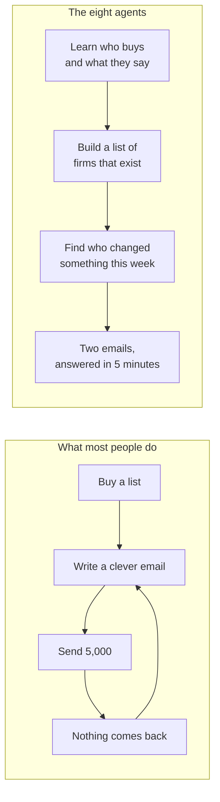
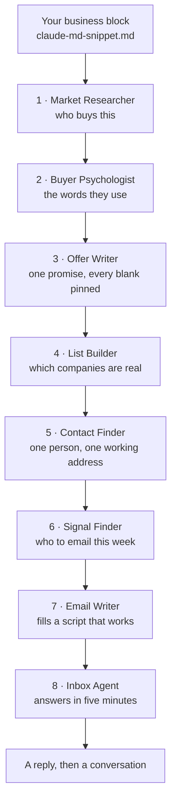

## What this is

Eight agents. Same eight, same order, whatever you sell.

**1** finds out who buys this. **2** finds the words they use for their own problem. **3** turns it into one promise with every blank pinned. **4** works out which companies are actually real. **5** finds one person and one working address. **6** decides who is worth emailing **this week**. **7** fills a script that already works. **8** answers the reply inside five minutes.

Nothing here is software. It is eight prompts, run in order, plus the gates that stop
each one handing rubbish to the next.

## The problem

→ You buy a list. It looks fine.
→ You write a clever email. You send five thousand of them.
→ Almost nothing comes back.
→ So you rewrite the email.

The email was the third problem. On one real list, a quarter of the companies were not
even the kind of business they appeared to be, and out of everyone who could have been
emailed, **15%** had anything worth opening with.

You cannot write your way out of that.



## How it works



**The order is the product.** Most people start at agent 7, write a clever email, send it
to a list they bought, and wonder why nothing comes back.

Agent 2 is what produced the subject line in this build. You cannot work backwards to it.

## What you need first

| Tool | What it does here | Free or paid | Link |
|---|---|---|---|
| Claude | Runs all eight prompts | Free to start. Pro is $20 a month for higher limits | https://claude.ai |
| A free scraper | Opens and reads company websites, forums, review pages | Free | https://github.com/D4Vinci/Scrapling |
| A search key | Finds the threads, the job ads, the people | Serper is free for the first 2,500 searches | https://serper.dev |
| One contact tool | Finds the person and the email | You probably already pay for one — Apollo, Clay, or similar | https://apollo.io |
| An email verifier | Checks every address before it gets sent to | About $1 per 1,000 | https://millionverifier.com |
| A sending tool | Sends the two emails and catches the replies | Smartlead, Instantly, or whatever you already use | https://smartlead.ai |

> [!NOTE]
> If you already run outbound, you have four of these six. The two you might not have —
> the free scraper and the verifier — are the two that catch the mistakes.

> [!TIP]
> You can run agents 1, 2, 3 and 8 with nothing but a Claude account. That is half the
> stack, and agent 8 is the fastest win on this page. Start there if you want to see it
> work before you set anything up.

## Get the files

Everything is in a public folder on GitHub. No account, no sign-up, nothing to
unsubscribe from.

**The folder:** https://github.com/gary-chakraborty/gap-build-vault/tree/main/builds/outbound-agent-stack

You can read every file right there in the browser. Click a file name and it opens as a
page.

**To download all of them at once:**

1. Open https://github.com/gary-chakraborty/gap-build-vault
2. Find the green **Code** button near the top right of the file list.
3. Click it. A small menu drops down.
4. Click **Download ZIP** at the bottom of that menu.
5. Open the ZIP, then open the folder `builds/outbound-agent-stack`.

| File | What it is | What you do with it |
|---|---|---|
| `claude-md-snippet.md` | A fill-in-the-blanks block about your business | Fill in every bracket, paste it into your project once |
| `01-market-researcher-prompt.md` | Who buys this and what they pay | Paste into a new chat, let it run |
| `02-buyer-psychologist-prompt.md` | The words the buyer uses themselves | Run after agent 1. Put the top 5 phrases back in your block |
| `03-offer-writer-prompt.md` | One promise, with every blank pinned | Run once per segment |
| `04-list-builder-prompt.md` | Real firms only, everything else binned | Run on 200 leads before you run it on 5,000 |
| `05-contact-finder-prompt.md` | The right person and an email that works | Verify everything it returns |
| `06-signal-finder-prompt.md` | Who is worth emailing this week | Re-run weekly. Signals expire |
| `07-email-writer-prompt.md` | Fills a script that already works | Never lets you write a new one |
| `08-inbox-agent-prompt.md` | Colour, reason, and the draft to send | Keep this tab open all day |
| `the-two-emails.md` | The whole worked campaign, both emails | Copy the shape, not the words |
| `pre-send-checklist.md` | Eight questions before anything goes out | Read it out loud before every launch |
| `setup-checklist.md` | The install order and your first week | Follow it day one |
| `dashboard.html`, `page.css`, `build_page.py` | Build machinery for the web version of this page | Ignore, unless you are editing the page. If you change a prompt file, run `python3 build_page.py` so the page matches |

## Build it

### Step 0: Teach it your business

1. Go to https://claude.ai and sign in.
2. In the left sidebar, click **Projects**, then **New project**. Name it `Outbound Stack`.
   - You should now be inside an empty project with its own chat box.
3. Open `claude-md-snippet.md`. Fill in every bracket with your real details.
4. In the project, find **Project knowledge** on the right. Click **Add content**, then
   **Add text**, and paste your filled-in block. Save it.
   - You should see it listed under Project knowledge.

> [!WARNING]
> Do not leave a single bracket unfilled. An empty slot means Claude guesses, and a guess
> about your price, your guarantee, or a client result gets sent to a real buyer. If you
> do not have the thing, write "no guarantee yet" so it has a rule to obey.

**You know this worked when:** you open a new chat in the project, ask "what do I
sell and who do I sell it to", and it answers with your real offer and your real buyer.

### Steps 1 and 2: Learn who buys, and what they call it

1. New chat. Paste the whole code block from `01-market-researcher-prompt.md`. Press enter.
   - It should show you each step as it finishes, not all of it at the end.
2. Read the brief. **Delete every fact that has no date on it.**
3. New chat. Paste `02-buyer-psychologist-prompt.md`.
4. Open three of the quotes it returns and check them yourself.
5. Take the top 5 phrases into `claude-md-snippet.md` and update your project knowledge.

> [!WARNING]
> A quote with no source is an invented quote. It will read as invented to the buyer too.
> Make it produce the URL and the date for every one, and delete the ones it cannot.

**You know this worked when:** one of the phrases makes you think "I would never
have written that". That is exactly the phrase to build on.

### Steps 3, 4 and 5: Build the list

1. Paste `03-offer-writer-prompt.md`. You want **one** promise back, with one number.
2. Run the pin test on it: could two people fill this slot two ways and both be right?
   If yes, pin it harder before you move on.
3. Paste `04-list-builder-prompt.md`. Start with **200 leads, not 5,000**.
4. Read the BIN list and the reasons. This is where you find out your search was wrong.
5. Paste `05-contact-finder-prompt.md`. Verify every address. Drop the invalids. Park the
   catch-alls in their own list.

> [!WARNING]
> A bad list at 5,000 costs you your sending domain. A bad list at 200 costs you an
> afternoon. There is no version of this where going big first is the cheap option.

**You know this worked when:** things got binned, and you agree with why.

### Step 6: Work out who to email this week

1. Paste `06-signal-finder-prompt.md`.
2. Check five of the signals at the source yourself. Open the job ad. **Read the date on
   the page, not the date on the filter.**
3. Split the list. Live signal → campaign. No signal → watch list.

> [!NOTE]
> Most of your list will not make it, and that is the agent working. On one real run, 235
> out of 18,799 people were worth emailing that week. The other 18,564 were not gone, they
> were just not ready.

**You know this worked when:** you can say out loud, for any lead on the send list,
what changed at their company and when.

### Steps 7 and 8: Send, and answer

1. Paste `07-email-writer-prompt.md`.
2. Count the words on email 1 yourself. Under 64 or cut it.
3. **Make the thing your follow-up offers, before you send.** A checklist you have not
   written yet is the fastest way to lose a reply you just earned.
4. Load it as **its own campaign**, with its own list. Two emails: first, then one
   follow-up on day two. Then it stops.
5. Paste `08-inbox-agent-prompt.md` into a chat and leave that tab open.
6. Send a test to yourself, reply to it, and run your own reply through agent 8.

> [!WARNING]
> Never load signal-routed copy as variants of one campaign. Sending tools rotate variants
> at random across the whole list, so one signal's email reaches leads it does not
> describe, every enrichment credit you spent is wasted, and nothing tells you it happened.
> One signal, one campaign, one list.

**You know this worked when:** a test reply comes back with a colour and a draft you
would only change a word or two of.

## Run it the first time

Paste this into your agent 8 chat, exactly as written. It is a made-up lead.

```
Hey thanks for reaching out, what's this going to cost roughly?
```

You should get back something close to this:

> **YELLOW**
> Why: they are evaluating, not committing, and they asked a direct price question.
> Next: do not quote a number. Acknowledge it, then offer two times.

And a draft close to:

> Good question. It depends on scope, so it's something we cover on the call. Happy to
> walk you through it. Thursday at 2pm or Friday at 11am?

That is the loop. Reply in, colour out, draft out, you send.

## The numbers this build produced

Real measurements from real runs. Yours will differ — measure your own.

| Gate | What went in | What came out | When |
|---|---|---|---|
| Agent 4, reading the websites | 1,642 raw leads → 380 passed the quick filters | **27% of the 380 were not even accounting firms** — software companies, marketplaces and recruiters with the right words on the page | 2026-07-22 |
| Agent 6, the signal gate | 18,799 people who could be emailed | 1,437 carried a signal. **235 were real and fresh** — 15% of the ones that looked good | 2026-08-20 |
| Agent 6, checking at the source | one "they are hiring" list | **41% had no live job ad at all.** One "fresh" posting was ten months old | 2026-08-20 |
| Agent 5, single source vs waterfall | one build ran on one provider | **744 firms lost** that the rest of the chain would have covered | 2026-08 |

## When it breaks

| What you see | What it means | What to do |
|---|---|---|
| A section comes back empty and calm | A site blocked it and it stayed quiet | Ask which sources returned data and which refused. **An empty result must never look like "nothing to find"** |
| Facts with no dates | It skipped the freshness rule | "Every fact carries its publish date and the date you read it." Redo it |
| Quotes that read like ad copy | It wrote them instead of finding them | Demand the URL and date for each. Delete what it cannot produce |
| Nothing gets binned by agent 4 | It filtered on keywords instead of reading | "Open each site and tell me what the company actually does, in their words" |
| Almost every lead has a signal | It counted facts as changes | A signal is a **change**, with a date. "They are an accounting firm" is not one |
| Job ads that turn out to be dead | It trusted a platform's date filter | Open each ad. The date on the page is the date |
| Email 1 came back at 90 words | It did not count | Make it print the word count under every draft |
| A case study appears in email 1 | Proof leaked forward | Cut it. Proof lives in the follow-up and on the call |
| Replies arrive but nothing fires | The webhook was never saved, or it is on the wrong scope | Send yourself a test reply and watch it run end to end |
| It sent something on its own | You automated past the human step | Every message node creates a **draft**, never a send |
| Reply rate looks flat across the board | You are reading a blended number | Split it by signal type. A blended rate hides the one lane that works |

## What is not in here

**The full install** — keys, permissions, scopes, first run, what each error message means
— is its own video. Doing it properly takes longer than a section, and half of it is
watching someone click through a settings page.

**Agent 8 automated.** The prompt works with copy and paste from day one. Wiring the
webhook is a separate build and it is not what makes the difference. Answering in five
minutes is.

## Tell me how it went

I am not asking for your email. There is no list, no sequence, nothing to unsubscribe from.

Two minutes, three things: how you found this, whether it was useful, and what you want me
to build next. https://form.jotform.com/262194392563059

The next build comes from those answers.
