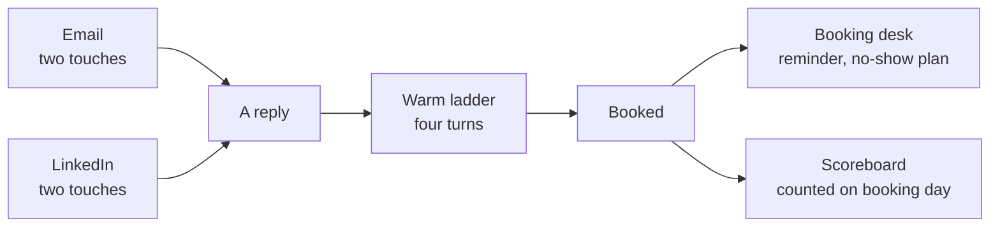

## What this is

The back half of the system. The other builds in this vault get a stranger to reply. This one turns the reply into a
call that actually happens, and counts it honestly.

- **LinkedIn in two touches**, on the lane that actually delivers.
- **A warm reply ladder**: four turns, one question each, the call offered on turn four.
- **A booking desk**: one owner, a two-column call list, and a plan for every no-show.
- **A weekly scoreboard** script that reads your sending tools and your calendar and prints the real numbers.

## The problem

→ Someone replies "sounds interesting".
→ You send the calendar link straight away.
→ They go quiet. Or they book, and do not show up.
→ At the end of the week nobody can say how many calls came from where.

The reply was never the finish line. And a scoreboard that divides by emails sent, or counts a call on the day it
happens instead of the day it was booked, tells you the wrong story about what is working.

## How it works



## The whole stack, in order

This build is the last piece. Run the others first.

| Step | Build | What it does |
|---|---|---|
| 1 | [`signal-prospecting-system`](../signal-prospecting-system) | Who changed something this week |
| 2 | [`outbound-agent-stack`](../outbound-agent-stack) | Eight agents, research to two emails |
| 3 | [`reply-to-booked-call`](.) | The LinkedIn lane |
| 4 | [`ai-inbox-manager`](../ai-inbox-manager) | Sorts replies, drafts the answer |
| 5 | [`reply-to-booked-call`](.) | Warm replies and the booking desk |
| 6 | [`reply-to-booked-call`](.) | The numbers, every Monday |

## What you need first

| Tool | What it does here | Free or paid | Link |
|---|---|---|---|
| A LinkedIn sending tool | Runs the two LinkedIn touches | HeyReach, or whatever you use | https://heyreach.io |
| An email sending tool | Runs the two emails | Smartlead, or whatever you use | https://smartlead.ai |
| Calendly | Holds the bookings the scoreboard counts | Free plan works for the API token | https://calendly.com |
| Python 3 | Runs the scoreboard script | Free, already on most Macs | https://python.org |
| One person | Owns every booked call | Your setter, or you | |

> [!NOTE]
> The script reads Smartlead, HeyReach and Calendly. If you use other tools, the three rules at the top of the script
> still apply: swap the three read functions and keep the counting.

## Get the files

**The folder:** https://github.com/gary-chakraborty/gap-build-vault/tree/main/builds/reply-to-booked-call

| File | What it is | What you do with it |
|---|---|---|
| `linkedin-two-touches.md` | Which lane, which touch, when to stop | Build your LinkedIn sequences from it |
| `warm-reply-ladder.md` | The four turns for anyone already talking to you | Keep it open next to your inbox |
| `booking-desk.md` | Owner, call list, reminders, no-shows | Give it to whoever owns the calls |
| `weekly_scoreboard.py` | Prints the two tables | Run it every Monday |

## Build it, by talking to Claude

You do not split the LinkedIn list by hand, and you do not type the call list yourself. You hand Claude this folder and
answer its questions. Full setup, both ways in, is in [SETUP-WITH-CLAUDE.md](https://github.com/gary-chakraborty/gap-build-vault/blob/main/SETUP-WITH-CLAUDE.md). The short
version:

- **In your browser:** claude.ai, new project, add these four files to Project knowledge.
- **In your editor:** open this folder in Claude Code (VS Code, Cursor, Antigravity or the terminal) and it reads the
  files itself.

Then three prompts, in order. Paste each one as it is written.

### Job 1: split the LinkedIn list, and write both sequences

```text
Read linkedin-two-touches.md.

Here is my export of the people I want to reach on LinkedIn (CSV attached). For each
person, decide which lane they belong in: the InMail lane only if the profile is an
Open Profile, the connection-request lane for everyone else. If you cannot tell from
the row, put them in the connection lane and say why.

Give me back two CSVs, one per lane, and for each lane the two touches written out:
touch 1, touch 2, and the wait between them. Touch 2 asks one question that needs a
fact to answer. Nothing over 64 words. Then tell me what you were unsure about.
```

**You know this worked when:** you get two files, and nothing in your LinkedIn tool shows as cancelled after day one.

### Job 2: build today's call list

```text
Read booking-desk.md.

Here are the threads for everyone with a call booked this week (pasted below).
Build today's call list. One row per person, and exactly two context columns:
"What happened" in 2 to 4 plain sentences, ending with the first line I say on the
phone, and "Their last message" in their own words with one line of context.

Where something is missing, write what is missing. Never leave a cell blank.
Then list who has no reminder scheduled yet and draft the reminder for each.
```

**You know this worked when:** you can read one row out loud and know how to open the call.

### Job 3: switch the scoreboard on

```text
Read weekly_scoreboard.py.

Walk me through getting the three API keys it needs, one at a time, and wait for me
after each one. Then run it and explain the two tables it prints in plain English:
what each row means, and which number I should be trying to move next week.

After that, set it to run every Monday morning and tell me where the output will land.
```

**You know this worked when:** you get two tables, and this week's booked count includes the calls that are set for
next week.

## Run it the first time

A real run on GAP's own numbers, week of 14 September 2026, read on the 18th:

- 1,450 new people emailed, 88 new people reached on LinkedIn.
- 6 new people booked a call. 3 came from LinkedIn, 2 from email, 1 from neither tracker.
- 9 calls booked in total, counting rebooks. 5 of them take place the week after.

A scoreboard that counted by call day would have shown 4 calls that week.

## Tell me how it went

I am not asking for your email. There is no list, no sequence, nothing to unsubscribe from.

Two minutes, three things: how you found this, whether it was useful, and what you want me to build next. https://form.jotform.com/262194392563059

The next build comes from those answers.
