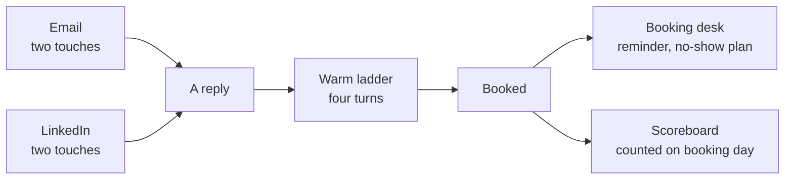

## What this is

Getting someone to reply is one job. Getting that person onto a call is a different job, and most people lose the
second one.

The other builds in this vault do the first job. They find the right companies and send the emails and LinkedIn
messages that get a reply. This build takes over from the moment somebody writes back.

It gives you four things:

- **How to run LinkedIn**, so your messages actually get delivered instead of quietly disappearing.
- **What to say to someone who replied.** Four short messages, one question in each, and you only offer the call in
  the fourth one.
- **A booking desk**, which is the boring stuff that stops booked calls falling apart: who owns the call, what the
  person making it needs in front of them, and what you send when somebody does not show up.
- **A small script** that reads your email tool, your LinkedIn tool and your calendar, then prints your real numbers
  every Monday.

You do not need to know how to code. You talk to Claude and it does the work.

## The problem

Here is what normally happens.

Someone replies and says "sounds interesting". You are pleased, so you send your calendar link straight back. Then one
of three things happens. They go quiet. Or they book and never show up. Or they book, the call happens, and at the end
of the week nobody can tell you where that call came from.

The last one costs you the most, because it means you cannot tell which half of your work is paying off.

The numbers usually lie for two reasons. The first is that people divide their reply rate by emails sent. One person
gets two or three emails, so the number comes out at about half of what it really is. The second is that people count
a call on the day it happens. Somebody books on Friday for the following Tuesday, and Friday's work gets no credit
for it.

## How it works



## Where this sits

The vault has two halves. The first half gets you replies. The second half, this build, turns them into calls.

**Getting replies:**

| Step | Build | What it does |
|---|---|---|
| 1 | [`signal-prospecting-system`](../signal-prospecting-system) | Finds who just changed something worth talking about |
| 2 | [`outbound-agent-stack`](../outbound-agent-stack) | Eight agents: research, the list, then the two emails |
| 3 | [`reply-to-booked-call`](.) | The LinkedIn side, in two messages |
| 4 | [`ai-inbox-manager`](../ai-inbox-manager) | Reads every reply and writes your answer |

**Turning those replies into calls, which is this build:**

| Step | File | What it does |
|---|---|---|
| 5 | `warm-reply-ladder.md` | What to say to somebody who replied |
| 6 | `booking-desk.md` | Reminders, the call list, no-shows |
| 7 | `weekly_scoreboard.py` | Your real numbers, every Monday |

## What you need first

| Tool | What it does here | Free or paid | Link |
|---|---|---|---|
| A LinkedIn sending tool | Sends the two LinkedIn messages | HeyReach, or whatever you use | https://heyreach.io |
| An email sending tool | Sends the two emails | Smartlead, or whatever you use | https://smartlead.ai |
| Calendly | Holds the bookings the script counts | The free plan gives you the key | https://calendly.com |
| Python 3 | Runs the script | Free, and already on most Macs | https://python.org |
| One person | Owns every booked call | Your setter, or you | |

> [!NOTE]
> The script reads Smartlead, HeyReach and Calendly because that is what we use. If you use different tools, ask
> Claude to swap the three bits that read them. The counting rules stay the same.

## Get the files

**The folder:** https://github.com/gary-chakraborty/gap-build-vault/tree/main/builds/reply-to-booked-call

| File | What it is | What you do with it |
|---|---|---|
| `linkedin-two-touches.md` | Which LinkedIn message goes to whom, and when to stop | Build your two LinkedIn sequences from it |
| `warm-reply-ladder.md` | The four messages after somebody replies | Keep it open next to your inbox |
| `booking-desk.md` | Who owns the call, the call list, reminders, no-shows | Give it to whoever runs your calls |
| `weekly_scoreboard.py` | Prints your two tables of numbers | Run it every Monday |

## Build it, by talking to Claude

You do not sort the LinkedIn list yourself, and you do not type the call list yourself. You give Claude this folder
and answer its questions.

There are two ways to do that, and both are written out step by step in
[SETUP-WITH-CLAUDE.md](https://github.com/gary-chakraborty/gap-build-vault/blob/main/SETUP-WITH-CLAUDE.md):

- **In your browser.** Go to claude.ai, start a project, and upload these files into it.
- **In your editor.** Open this folder with Claude Code, in VS Code, Cursor, Antigravity or a terminal, and it reads
  the files itself.

Then give it these three jobs, in this order. Copy each one exactly as it is written.

### Job 1: sort the LinkedIn list and write both sets of messages

LinkedIn has two ways to reach somebody, and picking the wrong one means your message is never delivered. Claude sorts
your list for you.

```text
Read linkedin-two-touches.md.

Here is my export of the people I want to reach on LinkedIn (CSV attached). For each
person, decide which lane they belong in: the InMail lane only if the profile is an
Open Profile, the connection-request lane for everyone else. If you cannot tell from
the row, put them in the connection lane and say why.

Give me back two CSVs, one per lane, and for each lane the two messages written out:
message 1, message 2, and how long to wait in between. Message 2 asks one question
that can only be answered with a fact. Nothing over 64 words. Then tell me what you
were unsure about.
```

**You know it worked when:** you get two files back, and nothing in your LinkedIn tool says "cancelled" after the
first day.

### Job 2: build today's call list

Whoever makes the calls needs the story in front of them, not five browser tabs.

```text
Read booking-desk.md.

Here are the threads for everyone with a call booked this week (pasted below).
Build today's call list. One row per person, and exactly two columns of context:
"What happened", in 2 to 4 plain sentences, ending with the first line I say on the
phone. And "Their last message", in their own words, with one line about what they
were replying to.

Where something is missing, write what is missing. Never leave a box empty.
Then tell me who has no reminder set up yet, and write the reminder for each of them.
```

**You know it worked when:** you can read one row out loud and know exactly how to open the call.

### Job 3: switch the numbers on

```text
Read weekly_scoreboard.py.

Walk me through getting the three API keys it needs, one at a time, and wait for me
after each one. Then run it, and explain the two tables it prints in plain English:
what each row means, and which number I should try to move next week.

After that, set it to run every Monday morning, and tell me where I will find it.
```

**You know it worked when:** you get two tables, and this week's booked number already includes the calls that are
sitting in next week.

## What this looked like for us

Our own numbers for the week of 14 September 2026, read on the 18th:

- We emailed 1,450 people who had never heard from us, and reached 88 more on LinkedIn.
- 6 of them booked a call with us for the first time. 3 came from LinkedIn, 2 from email, and 1 we could not trace.
- 9 calls were booked that week in total, once you count people who were rebooking. 5 of those calls were sitting in
  the following week.

If we had counted calls on the day they happened, that week would have looked like 4 calls instead of 9. You would
end up cutting the thing that is working.

## Tell me how it went

I am not asking for your email. There is no list, no sequence, nothing to unsubscribe from.

Two minutes, three things: how you found this, whether it was useful, and what you want me to build next. https://form.jotform.com/262194392563059

The next build comes from those answers.
