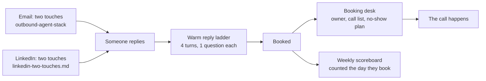

## What this is

The back half of the system. The other builds in this vault get a stranger to reply. This one turns the reply into a
call that actually happens, and counts it honestly.

- **LinkedIn in two touches**, on the lane that actually delivers.
- **A warm reply ladder**: four turns, one question each, the call offered on turn four.
- **A booking desk**: one owner, a two-column call list, and a plan for every no-show.
- **A weekly scoreboard** script that reads your sending tools and your calendar and prints the real numbers.

## The problem

→ Someone replies "sounds interesting".
→ You send the calendar link straight away.
→ They go quiet. Or they book, and do not show up.
→ At the end of the week nobody can say how many calls came from where.

The reply was never the finish line. And a scoreboard that divides by emails sent, or counts a call on the day it
happens instead of the day it was booked, tells you the wrong story about what is working.

## How it works



## The whole stack, in order

This build is the last piece. Run the others first.

| Step | Build | What it does |
|---|---|---|
| 1 | [`signal-prospecting-system`](../signal-prospecting-system) | Finds who changed something this week |
| 2 | [`outbound-agent-stack`](../outbound-agent-stack) | Eight agents, research to the two emails |
| 3 | [`reply-to-booked-call`](.) · `linkedin-two-touches.md` | The LinkedIn lane |
| 4 | [`ai-inbox-manager`](../ai-inbox-manager) | Sorts every reply and drafts the answer |
| 5 | [`reply-to-booked-call`](.) · `warm-reply-ladder.md`, `booking-desk.md` | Reply to booked call to call that happens |
| 6 | [`reply-to-booked-call`](.) · `weekly_scoreboard.py` | The numbers, every Monday |

## What you need first

| Tool | What it does here | Free or paid | Link |
|---|---|---|---|
| A LinkedIn sending tool | Runs the two LinkedIn touches | HeyReach, or whatever you use | https://heyreach.io |
| An email sending tool | Runs the two emails | Smartlead, or whatever you use | https://smartlead.ai |
| Calendly | Holds the bookings the scoreboard counts | Free plan works for the API token | https://calendly.com |
| Python 3 | Runs the scoreboard script | Free, already on most Macs | https://python.org |
| One person | Owns every booked call | Your setter, or you | |

> [!NOTE]
> The script reads Smartlead, HeyReach and Calendly. If you use other tools, the three rules at the top of the script
> still apply: swap the three read functions and keep the counting.

## Get the files

**The folder:** https://github.com/gary-chakraborty/gap-build-vault/tree/main/builds/reply-to-booked-call

| File | What it is | What you do with it |
|---|---|---|
| `linkedin-two-touches.md` | Which lane, which touch, when to stop | Build your LinkedIn sequences from it |
| `warm-reply-ladder.md` | The four turns for anyone already talking to you | Keep it open next to your inbox |
| `booking-desk.md` | Owner, call list, reminders, no-shows | Give it to whoever owns the calls |
| `weekly_scoreboard.py` | Prints the two tables | Run it every Monday |

## Build it

### Step 1: Split your LinkedIn list by lane

1. Export your LinkedIn list. Mark who is Open Profile.
2. Open Profile → the free message sequence. Everyone else → the Connect sequence.
3. Two touches each. Write touch 2 as one question that needs a fact to answer.

**You know this worked when:** no send shows as cancelled or failed in your LinkedIn tool after the first day.

### Step 2: Put one name on the calls

1. Pick the one person who owns every booked call.
2. Give them `booking-desk.md` and the warm reply ladder.
3. Build today's call list with the two columns: What happened, and Their last message.

**You know this worked when:** you can ask that person "who is booked for Tuesday and why" and they answer without
opening five tabs.

### Step 3: Run the scoreboard

1. Get three API keys: Smartlead (Settings, API key), HeyReach (Integrations, API), Calendly (Integrations, API and
   webhooks, personal access token).
2. In a terminal:

```bash
export SMARTLEAD_API_KEY="..."
export HEYREACH_API_KEY="..."
export CALENDLY_API_KEY="..."
export CALENDLY_EVENT_NAME="Intro call with Acme"
python3 weekly_scoreboard.py
```

3. Optional: keep a `positives.csv` with `date,channel,name` for every positive reply and add
   `export POSITIVES_CSV=positives.csv`. That fills the positive reply rows and tells the script which channel each
   booking came from.

**You know this worked when:** you get two tables, and the booked count this week includes calls that are set for
next week.

## Run it the first time

A real run on GAP's own numbers, week of 14 September 2026, read on the 18th:

- 1,450 new people emailed, 88 new people reached on LinkedIn.
- 6 new people booked a call. 3 came from LinkedIn, 2 from email, 1 from neither tracker.
- 9 calls booked in total, counting rebooks. 5 of them take place the week after.

A scoreboard that counted by call day would have shown 4 calls that week.

## When it breaks

| What you see | What it means | What to do |
|---|---|---|
| `STOPPED: Calendly returned no bookings` | The event name does not match exactly | Copy the event name from Calendly, including capitals |
| Smartlead read fails with 403 | Cloudflare blocked the request | Keep the browser user agent line in the script |
| Your email rate looks half of what you expected | Something is dividing by emails sent | Only Email 1 sends count as new people. Check your follow-up sequences are named with "follow-up" or "chase" |
| A person shows twice as booked | They rebooked with a different email | Merge them in your positives file by name |
| LinkedIn sends show as cancelled | Free messages went to people without Open Profile | Move them to the Connect lane |

## Tell me how it went

I am not asking for your email. There is no list, no sequence, nothing to unsubscribe from.

Two minutes, three things: how you found this, whether it was useful, and what you want me to build next. https://form.jotform.com/262194392563059

The next build comes from those answers.
