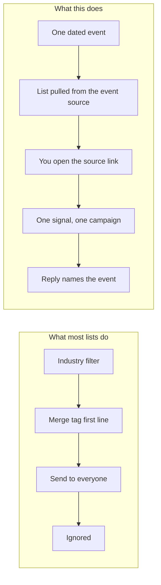
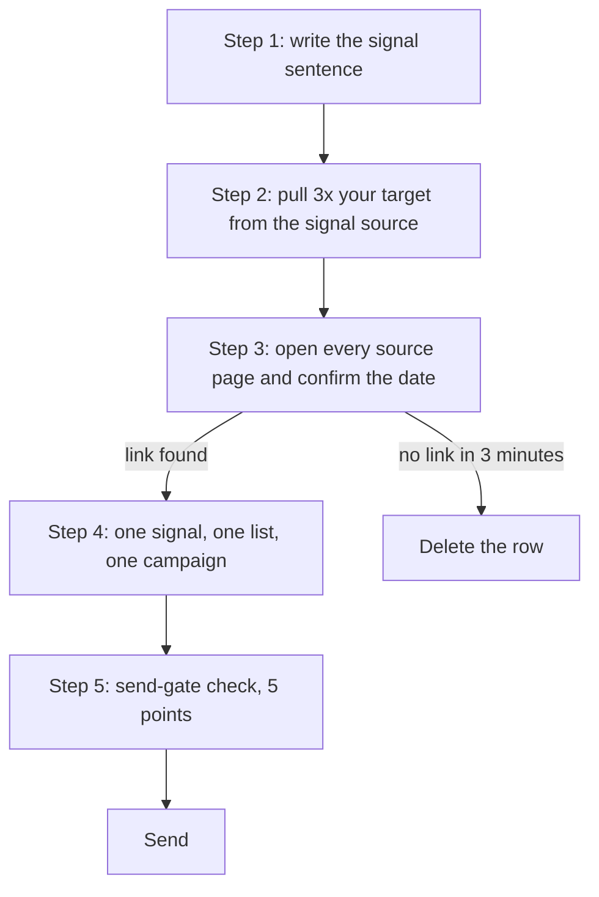

## What this is

A five-step check that turns one real, dated event into the reason you reach out this week.

- Writes one signal sentence you can point to a public page for
- Builds the company list from the signal source instead of an industry filter
- Kills any row you cannot verify yourself in three minutes

## The problem

- → 217 emails sent. Every one opens with a merge tag.
- → Four opens. Zero replies.
- → The list came from an industry filter, not a dated event.
- → Line one proves nothing, so nobody reads line two.

Cost: divide what the send cost you by the replies it earned.



## How it works



Not software. Nothing to install. Five steps you run once per segment and reuse for every list built against it.

- **Step 1** names one public, dated, causal event in a single sentence.
- **Step 2** starts at the source where the event lives (job board, funding page, licence board), never a bought list.
- **Step 3** is the only step that cannot be handed to a tool. You open the page yourself.
- **Step 4** keeps one signal on its own list so a reply traces back to the event that earned it.
- **Step 5** is a two minute gate that catches a stale date or a first line that never mentions the signal.

## What you need first

| Tool | What it does here | Free or paid | Link |
|---|---|---|---|
| Claude or ChatGPT with web search on | Runs the list-building prompt against your signal | Free tier works; paid plans start at $20/month | https://claude.ai |
| Google News | Finds and confirms the dated public event | Free | https://news.google.com |
| Greenhouse, Lever, Ashby job boards | Finds hiring signals for one exact role | Free to browse | https://www.greenhouse.io |
| Crunchbase | Finds funding rounds and their dates | Free tier; paid from $29/month | https://www.crunchbase.com |
| Google Sheets | Holds Company, Signal, Date, Source | Free | https://sheets.google.com |
| Your sending tool (Instantly, Smartlead, or similar) | Receives one campaign per signal | Paid, from $37/month | https://instantly.ai |

> [!NOTE]
> Before you start, be able to log into: your AI tool, Google Sheets, and whatever tool actually sends your email or DMs. If you cannot log into the sending tool today, do phases 1 to 3 anyway. Phase 4 can wait.

## Get the files

Everything for this build sits in one folder on GitHub. GitHub is just a website that holds files.

Direct folder link: https://github.com/gary-chakraborty/gap-build-vault/tree/main/builds/signal-prospecting-system

To get them onto your own computer without any software: open the link, click the green **Code** button near the top right, then click **Download ZIP**. That downloads the whole vault. Unzip it, then open the folder `builds/signal-prospecting-system`. You can also click any single file on GitHub and read it right there in the browser.

| File | What it is | What you do with it |
|---|---|---|
| `five-step-system.md` | The full method, step by step, with how long each step takes | Read once in Phase 1, then keep open while you work |
| `signal-picker.md` | Six signal categories with free sources, freshness windows, and what each implies | Pick exactly one category in Phase 1 |
| `list-building-prompt.md` | The research prompt that returns a table and refuses rows with no source link | Paste into your AI tool in Phase 2 |
| `send-gate-checklist.md` | Five checks to run before a campaign goes out | Run in Phase 4, every campaign, every time |

## Build it

### Phase 1: Pick one signal and write the sentence

1. Open `signal-picker.md`. Read the six rows in the table.
2. Pick the one category you can already find a source for today. Stop at one.
3. Open `five-step-system.md` and scroll to Step 1. Copy the sentence shape into a blank note.
4. Fill it in for your own market: company type, the dated public event, the plain reason it creates a need, and where you will look.
5. Run the trap check in that same section: if the sentence is true of every company in your market, it is a description, not a signal. Rewrite it.

> [!WARNING]
> "They are growing" and "they use HubSpot" are not signals. A signal is something that was not true six months ago and is true now.

**You know this phase worked when:** you can read one sentence out loud that names an event, a reason, and a public place to find it, and you can name the exact page type that proves it.

### Phase 2: Set up the sheet and run the list prompt

1. Go to sheets.google.com and click **Blank spreadsheet**.
2. In row 1, type five headers across: Company, Signal, Date, Source, Best contact title.
3. Rename the sheet after your signal, not after the month. One sheet per signal.
4. Open a new tab, go to claude.ai, and turn web search on in the chat box before you send anything.
5. Paste this prompt, filling in the bracketed fields from your Phase 1 sentence:

```
I'm building a list of [NICHE / INDUSTRY] companies that match one specific signal.

Signal definition: [PASTE YOUR ONE-SENTENCE SIGNAL DEFINITION FROM PHASE 1]

Find [TARGET COUNT x 3] companies where this signal happened in the last
[90 days / 12 months]. For each one, give me:

1. Company name
2. What the signal is, in one sentence, specific to this company (not a copy of the
   general definition, the actual event, e.g. "hired a VP of Sales on [date]", not
   "recently hired someone")
3. The exact date the event happened
4. A direct link to the public page where you found it (job post, press release,
   filing, news article, the actual page, not a search results page)
5. The best contact title to reach at this company for this signal

Rules:
- If you cannot find a direct source link for a company, do not include that company.
  A row with no link is worse than a shorter list.
- Do not include a company because it "fits the industry" if you can't point to the
  specific dated event. General industry fit is not the signal.
- If two companies have the exact same signal wording, check both again. A signal that
  reads identically across companies is usually the industry, not the event. Rewrite the
  wording to be specific to each company, or drop the weaker one.
- Give me the list as a table: Company | Signal | Date | Source link | Best contact title
```

6. Paste the returned table into your sheet.

> [!TIP]
> Ask for three times the number of companies you actually want. Most rows die in Phase 3, and that is the point.

**You know this phase worked when:** your sheet holds three times your target number of rows, and every row has something in the Source column.

### Phase 3: Verify the signals yourself

1. Start at row 2. Click the source link.
2. Confirm three things on the page itself: the event happened, it happened to that company, and the date sits inside your window.
3. If all three hold, paste the real page URL into the Source cell, replacing whatever was there.
4. If you cannot confirm it in about three minutes, delete the whole row. Do not soften the wording to keep it.
5. Repeat to the bottom of the sheet.
6. Count what survived. Fewer than a third surviving means your niche or your date window is too loose. Tighten one of them and rerun Phase 2.

> [!WARNING]
> AI tools return pages that no longer exist and pages about a different company with a similar name. A signal you did not personally open is a guess wearing a signal's clothes.

**You know this phase worked when:** every remaining row has a URL you personally clicked, and you can say the date of each event without looking it up again.

### Phase 4: Route one signal to one campaign

1. In your sending tool, create a **new campaign**, not a new variant inside an existing one.
2. Name it after the signal and the month, so a reply traces back to the event.
3. Upload only the verified rows from this one sheet. Nothing else goes in this campaign.
4. Write line one so it states the event, with the company's own detail in it. Write line two as what that event means for them.
5. Open `send-gate-checklist.md` and walk the five boxes. Every one has to be a real yes.
6. Send.

> [!WARNING]
> Never load two different signals into one campaign as Variant A and Variant B. Sending tools rotate variants at random across the whole list, so the funding message lands on the company whose signal was a new hire. A true A/B test compares two phrasings of the same signal on the same list.

**You know this phase worked when:** your sending tool shows one campaign holding one signal type, and every lead in it has a source link sitting in your sheet.

## Run it the first time

Made-up example, invented to show the shape. Do not treat any figure below as a result.

**Input to the prompt:**

> Niche: B2B software companies. Signal: closed a seed or Series A round in the last 90 days. Target count: 8, so ask for 24.

**What comes back:**

```
Company              | Signal                          | Date       | Source
Fielder Labs         | Closed $6.4M seed               | 2026-05-14 | company press page
Northrail Systems    | Closed Series A, amount undisclosed | 2026-04-02 | trade news article
Quillbank            | "Recently raised"               | unknown    | no link given
```

Row 1 survives: the press page loads, the date matches, the round is real. Row 2 survives if the article names the company and the date. Row 3 dies on the spot. No date, no link, no row.

> [!WARNING]
> The mistake almost everyone makes on the first run is stopping at the table. Pull five links at random from your own output and open them. If fewer than half hold up, the problem is your niche or your window, not the prompt. Fix that before you build the full list.

## When it breaks

| What you see | What it means | What to do |
|---|---|---|
| Every row reads almost the same, like "expanding operations" | The model matched your industry, not your event. That is a market condition, not a signal | Rewrite the Phase 1 sentence to name a specific event type with a date attached, then rerun. Reject any row whose signal sentence would fit a competitor unchanged |
| Source links 404, redirect to a homepage, or point at a search results page | The page moved, or the model produced a plausible looking URL it never opened | Search the company name plus the event in Google News yourself. Found within three minutes, keep the row with the real URL. Not found, delete it |
| Dates are older than your window, or the model writes "recently" instead of a date | The signal is stale, or was never dated | Delete the row. A stale signal read out loud to a prospect is worse than a generic opener, because it proves you did not check |
| The same company appears twice under different names, like "Northrail" and "Northrail Systems Inc" | Duplicate entries from two different sources | Sort the sheet by the Company column and read down it before Phase 4. Keep the row with the stronger source, delete the other. A prospect who gets two of your emails will not read either |
| The prompt returns 6 companies when you asked for 24 | The signal genuinely is rare in that market, or your window is too tight | Widen the window one step (90 days to 12 months for leadership changes only), or pick a second signal category from `signal-picker.md` and run it as its own separate campaign |
| Replies come back confused, saying "that is not us" | The signal belonged to a similarly named company, or a parent company | Check the domain on the source page against the domain you emailed. If they differ, the row was never verified properly. Rerun Phase 3 on the whole list |

## Tell me how it went

I read every one of these. Two minutes, five questions: what you used, how, and what happened. https://form.jotform.com/262191867802059 The best stories become the next build.

## Want this built for you?

This is one piece of the system we install for B2B service businesses: 15-25 qualified sales calls a month without referrals or hiring a sales team. If you'd rather have the whole thing built for you, grab a call: https://calendly.com/garychakraborty
